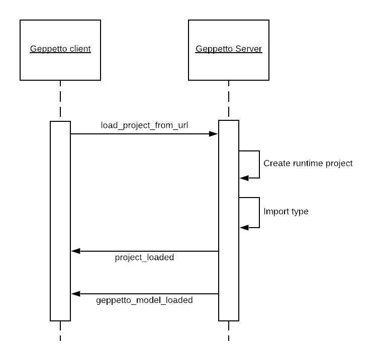

Geppetto API and Workflows
==========================

## High level workflow
The Geppetto workflow starts by loading a Geppetto project from the client application. A Geppetto project links to a Geppetto Model. After a project is loaded the model becomes available to the application which in turn can implement specific workflows. 

A **Geppetto application** (former *extension*) will define a set of custom workflows, e.g. visualize the content of the model, define experiments, control simulations, etc. An application will also define its own user interface reusing any of the Geppetto components or defining custom ones.

Another (old and deprecated) way to define custom behavior is through project scripts, which are custom
Javascript files which are loaded with the project.

The main Geppetto workflow is controlled through messages in the frontend.

## Websocket API
A websocket channel is set up at the client bootstrap.
The communication is based on JSON format messages with this general structure:

* requestID
* type
* data: the actual message payload. It is specific for every message.

### Inbound messages


#### geppetto_version

Asks for the current Geppetto version number. This is automatically called during the bootstrap.

Example request:
```JSON
{"requestID":"0","type":"geppetto_version","data":"null"}
```

### user_privileges

Asks for user privileges. Used when the backend of Geppetto has a persitence module available which provides support for user authentication and privileges.


* notify_user
* get_script
* get_data_source_results

### Loading a Geppetto Project and Model

We have different ways to load a project:
* load_project_from_url
* load_project_from_id
* load_project_from_content

Examples:
```JSON
{"requestID":"Connection1-1","type":"load_project_from_url","data":"https://github.com/OpenSourceBrain/NWBShowcase/raw/master/NWB/time_series_data.nwb"}
```
```JSON
{"requestID":"null-1","type":"load_project_from_id","data":"{\"projectId\":\"1\"}"}
```


#### save_project_properties
#### persist_project
#### make_project_public
#### download_project
#### new_experiment
#### new_experiment_batch
#### clone_experiment
#### load_experiment
#### save_experiment_properties
#### delete_experiment
#### get_experiment_state
#### experiment_status
#### run_experiment
#### set_watched_variables
#### get_watch
#### clear_watch
#### set_parameters
#### set_experiment_view
#### link_dropbox
#### unlink_dropbox
#### get_dropbox_token
#### upload_model
#### upload_results
#### get_supported_outputs
#### download_model
#### download_results
#### fetch_variable
#### resolve_import_type
#### resolve_import_value
#### run_query
#### run_query_count
### Outbound messages

The outbound messages (from the server to the client) can be both in text or gzip format. 

#### geppetto_version

Response to inbound geppetto_version
Example:
```JSON
{"requestID": "null-0", "type": "geppetto_version", "data": "{\"geppetto_version\": \"0.4.2\"}"}
```
### user_privileges
Defines the current user privileges
```JSON
{"requestID": null, "type": "user_privileges", "data": "{\"user_privileges\": \"{\\\"userName\\\": \\\"Python User\\\", \\\"loggedIn\\\": true, \\\"hasPersistence\\\": false, \\\"privileges\\\": [\\\"READ_PROJECT\\\", \\\"WRITE_PROJECT\\\", \\\"RUN_EXPERIMENT\\\", \\\"DROPBOX_INTEGRATION\\\", \\\"DOWNLOAD\\\", \\\"ADMIN\\\"]}\"}"}
```
#### project_loaded
Returns the loaded project to the frontend
```JSON
{"requestID": "Connection1-1", "type": "project_loaded", "data": "{\"project_loaded\": \"{\\\"persisted\\\": false, \\\"project\\\": {\\\"id\\\": 0, \\\"name\\\": \\\"NWB file time_series_data.nwb\\\", \\\"geppettoModel\\\": {\\\"id\\\": null, \\\"type\\\": \\\"MODEL\\\"}, \\\"baseUrl\\\": null, \\\"experiments\\\": [], \\\"activeExperimentId\\\": -1, \\\"volatile\\\": true, \\\"view\\\": null, \\\"isPublic\\\": false}, \\\"isReadOnly\\\": true}\"}"}
```
```JSON
{"requestID":"null-1","type":"project_loaded","data":"{\"project_loaded\":\"{\\\"persisted\\\":true,\\\"project\\\":{\\\"id\\\":1,\\\"name\\\":\\\"Hodgkin-Huxley Neuron\\\",\\\"experiments\\\":[{\\\"id\\\":1,\\\"aspectConfigurations\\\":[{\\\"id\\\":0,\\\"instance\\\":\\\"hhcell\\\",\\\"watchedVariables\\\":[\\\"hhcell.hhpop[0].v\\\",\\\"hhcell.hhpop[0].bioPhys1.membraneProperties.naChans.na.m.q\\\",\\\"hhcell.hhpop[0].bioPhys1.membraneProperties.naChans.na.h.q\\\",\\\"hhcell.hhpop[0].bioPhys1.membraneProperties.kChans.k.n.q\\\"],\\\"simulatorConfiguration\\\":{\\\"id\\\":1,\\\"simulatorId\\\":\\\"neuronSimulator\\\",\\\"conversionServiceId\\\":\\\"lemsConversion\\\",\\\"timestep\\\":5.0E-5,\\\"length\\\":0.3,\\\"parameters\\\":{...}}}\\\"}},\\\"isReadOnly\\\":true}\"}"}
```

### geppetto_model_loaded
It is sent when the model is loaded and contains the serialized model
Example:
```JSON
{"requestID": "Connection1-1", "type": "geppetto_model_loaded", "data": "{SERIALIZED MODEL}"}
```
#### client_id
Returns the client is assigned from the backend at bootstrap
```JSON
{"type":"client_id","data":"{\"clientID\":\"Connection660\"}"}
```
#### load_project
#### import_type_resolved
Returns the whole serialized model after a type is imported.
Example:
```JSON
{"requestID": "Connection1-1", "type": "import_type_resolved", "data": "{SERIALIZED MODEL}"}
```
#### import_value_resolved
Returns the whole serialized model after a value is imported.
Example:
```JSON
{"requestID": "Connection1-1", "type": "import_value_resolved", "data": "{SERIALIZED MODEL}"}
```


#### read_url_parameters
#### 
#### error_loading_project
#### server_unavailable
#### server_available
#### experiment_running
#### info_message
#### simulation_configuration
#### generic_error
#### error_running_experiment
#### error_loading_simulation_config
#### error_reading_script
#### error_setting_watched_variables
#### error_downloading_model
#### error_downloading_results
#### geppetto_version
#### script_fetched
#### data_source_results_fetched
#### get_scripts
#### watched_variables_set
#### clear_watch


#### fire_sim_scripts
#### simulation_over
#### get_supported_outputs
#### download_model
#### set_parameters
#### no_feature
#### experiment_loading
#### experiment_loaded
#### experiment_status
#### experiment_deleted
#### get_experiment_state
#### project_persisted
#### download_project
#### project_props_saved
#### project_made_public
#### experiment_props_saved
#### dropbox_linked
#### dropbox_unlinked
#### get_dropbox_token
#### results_uploaded
#### model_uploaded
#### download_results
#### update_model_tree
#### experiment_created
#### experiment_cloned
#### experiment_batch_created


#### variable_fetched


#### return_query
#### return_query_count
#### return_query_results
## Frontend messaging
Geppetto defines a series of event messages which are used

### Handle a Geppetto event
```Javascript
GEPPETTO.on(eventName, callback)
```

Example:
```Javascript
GEPPETTO.on(GEPPETTO.Events.Model_loaded, (model) => {
  app.setState({ model: Model }); // triggers the component to reload
});
```

### Trigger an event
Usually events are triggered by Geppetto core components.
Some events are meant to also be triggered during custom workflows.
```
GEPPETTO.trigger(eventName[, eventData]);
```

For example, this shows the spinner with a custom message:
```
GEPPETTO.trigger(GEPPETTO.Events.Show_spinner, "Initialising components");
```

### Event messages
GEPPETTO.Events global defines the system "standard" events.
In a custom application other events can be defined to handle the custom workflow.

#### Project workflow messages
* Project_persisted: project:persisted
* Project_loading: project:loading
* Project_loaded: project:loaded
* Project_downloaded: project:downloaded
* Project_properties_saved : project_properties_saved
* Project_made_public: project_made_public
#### Model and instances
* Model_loaded: model:loaded
* Instance_deleted: instance:deleted
* Instances_created: instances:created

#### Experiment workflow events
* Select: experiment:selection_changed
* Experiment_loaded: experiment:loaded
* ModelTree_populated: experiment:modeltreepopulated
* SimulationTree_populated: experiment:simulationtreepopulated
* Do_experiment_play: experiment:doPlay
* Experiment_play: experiment:play
* Experiment_status_check: experiment:status_check
* Experiment_pause: experiment:pause
* Experiment_resume: experiment:resume
* Experiment_running: experiment:running
* Experiment_stop: experiment:stop
* Experiment_completed: experiment:completed
* Experiment_failed: experiment:failed
* Experiment_update: experiment:update
* Experiment_updated: experiment:updated
* Experiment_renamed: experiment:renamed
* Experiment_deleted: experiment_deleted
* Experiment_active: experiment_active
* Experiment_created: experiment:created
* Experiment_over: experiment:over
* Experiment_properties_saved : experiment_properties_saved
* Visibility_changed: experiment:visibility_changed
#### UI events
* Focus_changed: experiment:focus_changed
#### Widget specific events
##### Spotlight
* Spotlight_closed: spotlight:closed
* Spotlight_loaded: spotlight:loaded
##### Tutorial
* Show_Tutorial: show_tutorial
* Hide_Tutorial: hide_tutorial
##### Spinner
* Show_spinner: spinner:show
* Hide_spinner: spinner:hide
##### Control panel
* Control_panel_open: control_panel:open
* Control_panel_close: control_panel:close
##### Canvas
* Canvas_initialised: canvas:initialised
##### Command
* Command_log : command:log
* Command_log_debug : command:log_debug
* Command_log_run : command:log_run
* Command_clear : command:clear
* Command_toggle_implicit : command:toggle_implicit
#### Communication with backend events
* Receive_Python_Message: receive_python_message
* Websocket_disconnected : websocket_disconnected
#### Other
* Color_set: color:set
* Lit_entities_changed: lit_entities_changed
* Component_destroyed: component_destroyed
* Parameters_set : parameters_set
