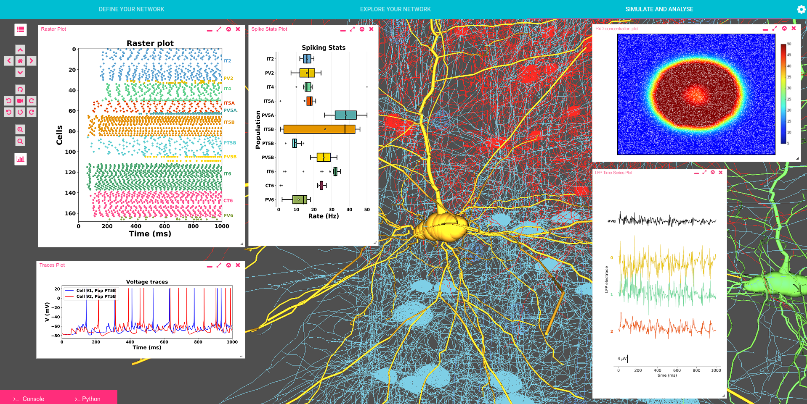

How Do I create My Own Geppetto Application?
==============

Creating your own Geppetto application is very simple, as simple as cloning [geppetto-application](https://github.com/openworm/geppetto-application) repository (to use it as a template) and then modifying `./components/Application.js` with your custom code. You might want to create a GitHub repository to contain your files and then replace the content of the folder `org.geppetto.frontend/scr/main/webapp` with the content of your repository. The default Geppetto application repository contains also other files that might be of interest:

- The `.eslintrc.js` file will allow you to configure linting rules on top of the default rules we are already enforcing for the default Geppetto applications. Check the default linting rules we are inheriting from geppetto-client repository [here](https://github.com/openworm/geppetto-client/blob/development/.eslintrc.js).
- In `GeppettoConfiguration.json` file you will have to specify how are you planning to use the Geppetto application. Is it going to be embedded in an iframe? are you planning to use a context path? Would you like to use a different color scheme for built-in Geppetto components?
- The `package.json` file is installing NPM `geppetto-client` package (which contains all the different npm packages required for the default Geppetto application to work). But you can include extra npm packages there that you are planning to use in your custom Geppetto application.
- Finally `webpack.config.js` controls the way your custom Geppetto application will be build. 

Coming back to the main file (`./components/Application.js`), you can define there your own js functions as needed and interact with the Geppetto API to add components that Geppetto makes available. For example, the following code adds the 3D canvas component to the background element with id="sim" (a commonly used component conveniently provided by Geppetto):

```
//Canvas initialization
<div id="sim">
    <Canvas
        id="CanvasContainer"
        name={"Canvas"}
        ref="canvasRef"
    />
</div>
```

Or as another example, the code below is injecting a logo component to the element with id="geppettologo" (again, conveniently provided by Geppetto; it appears in the top right) and then injecting a Link button component, that links to the source code on GitHub, while also specifying a position for this element:

```
<Logo
    logo='gpt-gpt_logo'
    id="geppettologo"
/>

<div id="github-logo">
    <LinkButton
        left={41}
        top={390}
        icon='fa fa-github' 
        url='https://github.com/openworm/org.geppetto'
    />
</div>
```

*NOTE*: Since Geppetto exposes a dependency to [react.js](https://reactjs.org/) (much of its internals use this framework), we highly encourage you to write your custom code as React components. But nothing will stop you from adding DOM elements with jQuery (or vanilla js). If a DOM element is not specified, the component will be added in a floating window (also known as a "Geppetto widget").

Geppetto Application Examples
==============

You can achieve virtually any look & feel with a Geppetto application. We provide below some examples of UIs built as Geppetto applications (code also linked if available as open source software):

[**geppetto-default**](https://github.com/openworm/geppetto-application.git): the default Geppetto application we know and love, available on [live.geppetto.org](https://live.geppetto.org/).


[**geppetto-osb**](https://github.com/OpenSourceBrain/geppetto-osb/tree/development): Geppetto application for [Open Source Brain](http://www.opensourcebrain.org/), a repository of open source computational neuroscience models that features a Geppetto based 3D viewer of morphologies and simulation environment.


[**geppetto-vfb**](https://github.com/VirtualFlyBrain/geppetto-vfb/tree/development): Geppetto application for [Virtual Fly Brain](https://v2a.virtualflybrain.org/), a reference for drosopohila neuroanatomy and ontology. 


**geppetto-hm**: [Patienthm.org](http://patienthm.org/), portal and atlas of all [Patient HM](https://en.wikipedia.org/wiki/Henry_Molaison) imaging data entirely built as a Geppetto application. 


[**geppetto-netpyne**](https://github.com/MetaCell/NetPyNE-UI): Geppetto application for [NetPyNE](http://www.netpyne.org/), a python package to facilitate the development, parallel simulation and analysis of biological neuronal networks using the NEURON simulator. 


How to deploy a Geppetto application in my Eclipse environment
==============

In this section we will show you how to deploy a custom Geppetto application to your local Geppetto environment. The below assumes that you already have your Geppetto and Eclipse environment configured locally. If that is not the case, see the following pages:
-   [Source Setup on OSX and Linux](http://docs.geppetto.org/en/latest/osxlinuxsetup.html) or [Source Setup on Windows](http://docs.geppetto.org/en/latest/windowssetup.html)
-   [Instructions for setting up Geppetto on Eclipse Neon](http://docs.geppetto.org/en/latest/eclipsesetup.html)

First of all, starting from our home folder we begin by cloning the custom Geppetto application repository into the Geppetto Frontend's webapp folder, located in the geppetto-sources folder.

```
cd geppetto-sources
cd org.geppetto.frontend/src/main
git clone https://github.com/MyGitHubUser/geppetto-custom-application webapp
```

Once done we will need to update our org.geppetto.frontend project to take into account the changes made. We can start by right clicking on the bundle org.geppetto.frontend->Maven->Update Project. Then, we right click again on org.geppetto.frontend->Run As->Maven Install. This will re-build our bundle and npm will automatically redeploy the frontend to the Virgo server's folder so that we can use the new application.
Once the server finishes starting all the bundles, we can open the [Geppetto frontend homepage](http://localhost:8080/org.geppetto.frontend/) with our browser and see our loaded application working.

Geppetto Build
==============

-   Geppetto Configuration
-   Maven Profiles
-   Development Build
-   Production Build

Geppetto Configuration
======================

Geppetto lets you configure your deployment with a set of parameters
that are defined in
org.geppetto.frontend/src/main/webapp/GeppettoConfiguration.json. This
file exposes the following parameters:

-   `contextPath`: The context path is the prefix of the URL path to
    access Geppetto. Typically contextPath is
    "org.geppetto.frontend" for development and "/" for production. Assuming a local
    development environment with contextPath "org.geppetto.frontend",
    you will access Geppetto at localhost:
    localhost:8080/org.geppetto.frontend
-   `useSsl`: If true, Geppetto will be configured to use https instead of http.
-   `embedded`: Geppetto is configured to work as an embedded instance
    inside an iframe. This means CORS will be enabled, a postMessage
    channel will be available for the main frame, some layout and href
    calls customization, etc.
-   `embbedderURL`: If running in embedded mode, this specifies the URL of
    the main frame container. For security reasons Geppetto will only
    accept cross-origin calls from this URL.
-   `noTest`: If true, tests are suppressed during the build process. If
    false, tests will be run as part of the build process.
-   `themes`: Defines a Geppetto "theme". So far, we only expose a few
    parameters defining colours. Below you can find a list of the
    parameters exposed that can be overridden by your custom theme file:

        @primary_color: #fc6320;
        @secondary_color: #fc401a;
        @background_color_body_0: #141a1e;
        @background_color_body_50: #5c6268;
        @background_color_body_73: #60666d;
        @background_color_body_100: #515359;
        @background_color_widget: rgb(66, 59, 59);

In order to implement a new theme, a less file needs to be created
defining some or all these parameters and the theme needs to be
specified in the themes and set to true.

This is how the default (and recommended for development environments)
GeppettoConfiguration.json looks:

```
{
  "_README" : "http://docs.geppetto.org/en/latest/build.html",
  "contextPath": "org.geppetto.frontend",
  "useSsl": false,
  "embedded": false,
  "embedderURL": ["/"],
  "rootRedirect":"",
  "noTest": false,
  "themes": "css/colors",
  "properties": {
    "title" : "geppetto",
    "description": "Geppetto is an open-source platform to build web-based tools to visualize and simulate neuroscience data and models. This is a live deployment to showcase its functionalities.",
    "type": "website",
    "url": "http://live.geppetto.org",
    "icon" :"geppetto/style/favicon.png",
    "image": "http://www.geppetto.org/images/logo.png"
  } 
}
```

Maven Profiles
==============

The Java based backend of Geppetto is built using Maven, with the "mvn -Dhttps.protocols=TLSv1.2 install" command. Maven
allows for different build steps to be specified for different
environments, and Geppetto provides a development and a production
profile (see below for how to trigger different builds). Builds can be
triggered at the root from the org.geppetto bundle and parameters will
be propagated to the children (child bundles are defined in
org.geppetto/pom.xml). Maven builds can also be triggered for individual
bundles from the specific bundle root that needs to be built.

Building for development
========================

`mvn -Dhttps.protocols=TLSv1.2 install`

When the command "mvn -Dhttps.protocols=TLSv1.2 install" is executed, none of the optimization
tasks are run. When doing development, it is not necessary to run the
production build unless you wish to simulate a production environment.

The default Geppetto application relies on `geppetto-client` npm package to bring the Geppetto 
build-in components to the client. If you need to work on this package, you can clone it 
from [here](https://github.com/openworm/geppetto-client.git) and then to use npm package `link` to
create a symlink to your custom Geppetto application as follow:

1. `git clone https://github.com/openworm/geppetto-client.git`
2. `cd geppetto-client`
3. `npm install` (installs npm packages required by geppetto-client).
4. `npm link` (creates a symlink from geppetto-client folder to a global folder used by link).
5. Go to the folder where you have your custom Geppetto application.
6. `npm link @geppettoengine/geppetto-client` (creates a symlink from the link global folder to yout Geppetto application.)

Now changes to your local geppetto-client folder will be reflected in your geppetto-application folder.

*NOTE*: up to npm version 6.4.0, the `npm install` command removes any symlink to packages from the node_module folder,
replacing them with what is download from GitHub or NPM registries. This behaviour will be removed in npm@7+ but until then,
the maven command:

`mvn -Dhttps.protocols=TLSv1.2 install`,

will remove your symlink from the Geppetto project. The only workaround right now it to push to GitHub your changes and then,
specifying your custom geppetto-client package in package.json like this:

```
{
    ...,
    "devDependencies": {
        // "@geppettoengine/geppetto-client": "openworm/geppetto-client#development"  < -- default
        "@geppettoengine/geppetto-client": "GitHub_User/Repo_name#Branch_name"        < -- replacement
    },
    ...
}
```

Building for production
=======================

`mvn -Dhttps.protocols=TLSv1.2 install -P master`

Some optimization tasks are applied to the org.geppetto.frontend bundle
to optimise performance and security. To see the difference between
profiles have a look at
org.geppetto.frontend/src/main/webapp/package.json.

Overriding Geppetto Parameters with mvn 
=======================================

Geppetto configuration settings can be overwritten by passing the
parameters to the "mvn -Dhttps.protocols=TLSv1.2 install" command. An example follows:

`mvn -Dhttps.protocols=TLSv1.2 install "-DcontextPath=theearth" "-DuseSsl=true" "-Dembedded=true" "-DembedderURL=universe,milkyway"`


NOTES
===

At this point when you run: 

`npm run build`,

in Geppetto application to generate the bundle files, we are also bundling files from geppetto-client package. In the future, we will completely decouple gepetto-client from geppetto-application so that geppetto-client can be seen as a truly independent and ready to use npm package.
