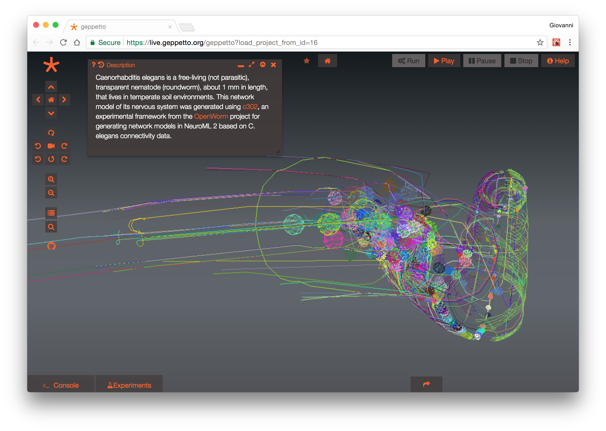
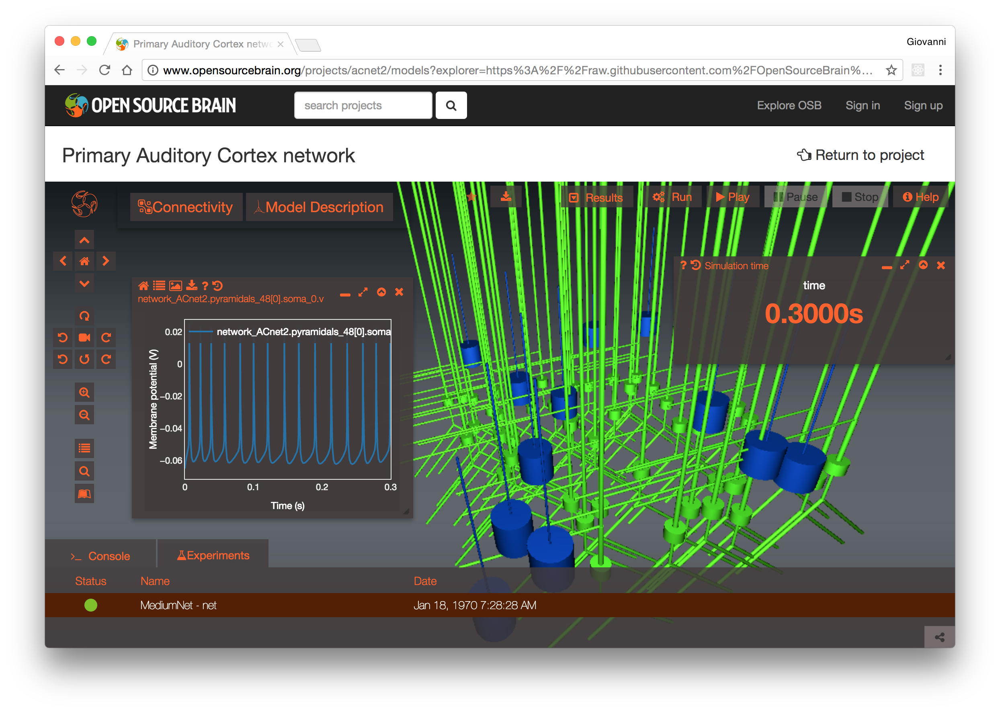
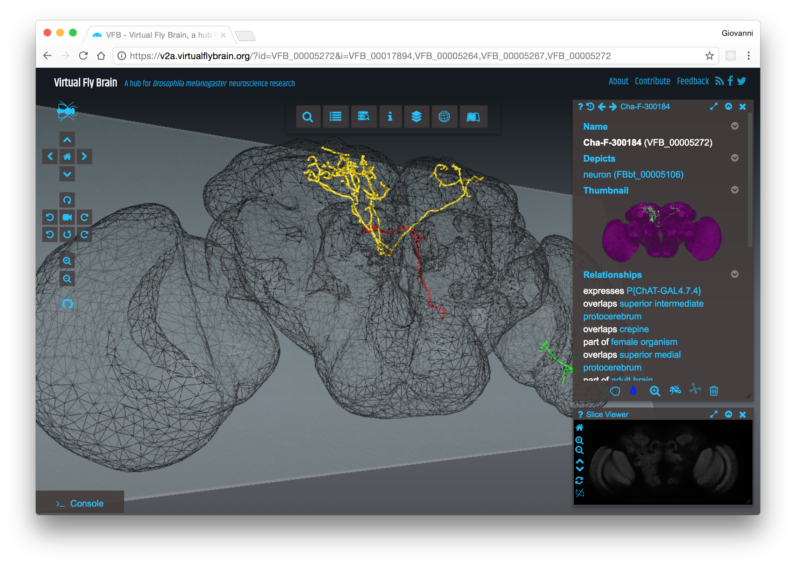
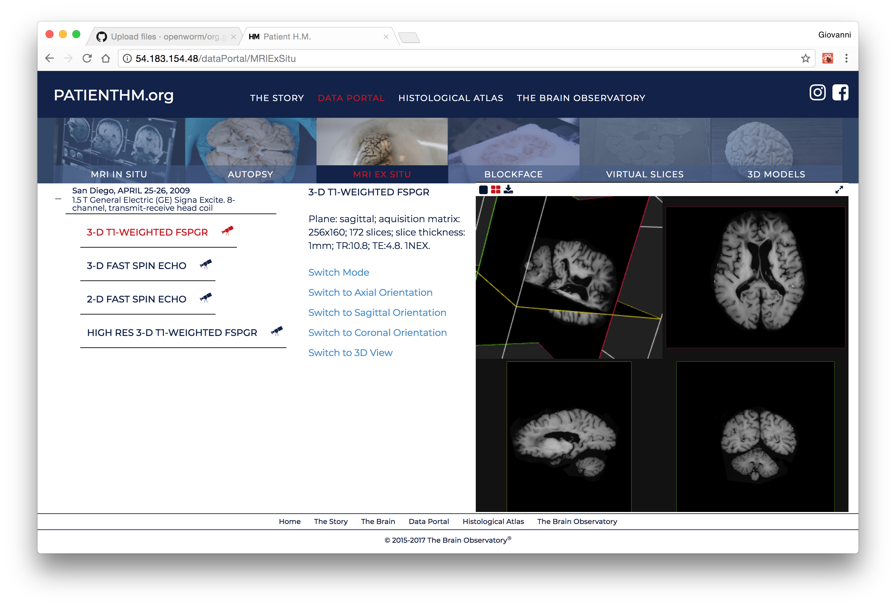
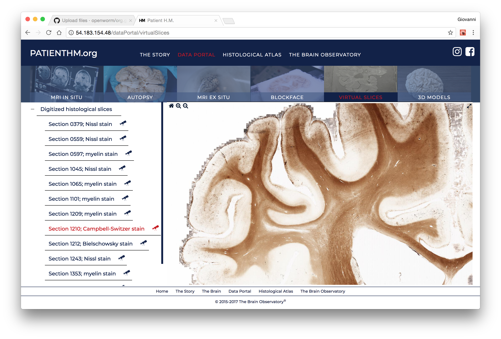

What is a Geppetto Extension?
==============

A Geppetto extension is a folder with some custom client code you can write to completely customise the Geppetto UI. The minimal extension consists of an entry point js file (normally named ComponentsInitialization.js, but it can be renamed to anything) and a css file. 

- **ComponentsInitialization.js**: This js file defines which components will be present in the Geppetto UI and where they are placed. 
- **CSS**: The css file is meant to provide styles for your Geppetto application. 

The minimal set is the two files described above but there is no limit to how complex an extension can be. For example you can develop any number of components and import them with require from any other js file in your extension. 

You can use any of the Geppetto dependencies inlcuded in the [package.json](https://github.com/openworm/org.geppetto.frontend/blob/master/src/main/webapp/package.json) in Geppetto, or add your own as static dependencies somewhere in your extensions folder. In the future each extension will have its own package.json file (this feature is on the Geppetto development roadmap). 

How Do I create My Own Geppetto Extension?
==============

Creating your own Geppetto extension is very simple, as simple as creating a folder with a js file and a css file. You might wanna create a github repo to contain your files and then clone the repo in the org.geppetto.frontend/scr/main/webapp/extensions folder. You will notice that in the extensions folder there is already a [default geppetto extension](https://github.com/openworm/org.geppetto.frontend/tree/master/src/main/webapp/extensions/geppetto-default), which defines the default geppetto ui and provides a first example of what you can do from your custom code to add components to the Geppetto ui. 

Now that you have created your own, you need to tell geppetto to use it instead of using the default one. This is very simple and achieved by editing the [GeppettoConfiguration.json](https://github.com/openworm/org.geppetto.frontend/blob/master/src/main/webapp/GeppettoConfiguration.json) file located in the same webapp folder. 

Assuming your extension repo/folder is named "geppetto-custom-extension" and you js entry point file is called ComponentsInitialization.js and your css is called theme.css, the GeppettoConfiguration.json should look like this:

```
{
    "_README" : "http://docs.geppetto.org/en/latest/build.html",
    "contextPath": "org.geppetto.frontend",
    "useSsl": false,
    "embedded": false,
    "embedderURL": ["/"],
    "noTest": false,
    "extensions": {
        "geppetto-default/ComponentsInitialization": false,
        "geppetto-custom-extension/ComponentsInitialization": true
    },
    "themes": {
        "geppetto-default/colors": false,
        "geppetto-custom-extension/theme": true
    }
}
```
All the other parameters in the json will be discussed under the "Geppetto Build" section of this same document. 

Geppetto Extensions Examples
==============

You can achieve virtually any look & feel with a Geppeto extension. We provide below some examples of UIs built as Geppetto extensions (extension code also linked if available as open source software):

[**geppetto-default**](https://github.com/openworm/org.geppetto.frontend/tree/master/src/main/webapp/extensions/geppetto-default): the default geppetto extension we know and love, available on [live.geppetto.org](https://live.geppetto.org/).


[**geppetto-osb**](https://github.com/OpenSourceBrain/geppetto-osb/tree/development): Geppetto extension for [Open Source Brain](http://www.opensourcebrain.org/), a repository of open source computational neuroscience models that features a Geppetto based 3D viewer of morphologies and simulation environment.


[**geppetto-vfb**](https://github.com/VirtualFlyBrain/geppetto-vfb/tree/development): Geppetto extension for [Virtual Fly Brain](https://v2a.virtualflybrain.org/), a reference for drosopohila neuroanatomy and ontology. 


**geppetto-hm**: [Patienthm.org](http://patienthm.org/), portal and atlas of all [Patient HM](https://en.wikipedia.org/wiki/Henry_Molaison) imaging data entirely built as a Geppetto extension. 



Geppetto Build
==============

-   Geppetto Configuration
-   Maven Profiles
-   Development Build
-   Production Build

Geppetto Configuration
======================

Geppetto lets you configure your deployment with a set of parameters
that are defined in
org.geppetto.frontend/src/main/webapp/GeppettoConfiguration.json. This
file exposes the following parameters:

-   `contextPath`: The context path is the prefix of the URL path to
    access Geppetto. Typically development contextPath is
    "org.geppetto.frontend" and "/" for production. Assuming a local
    development environment with contextPath "org.geppetto.frontend",
    you will access Geppetto at localhost:
    localhost:8080/org.geppetto.frontend
-   `useSsl`: if true, Geppetto will be configured to use https of http.
-   `embedded`: Geppetto is configured to work as an embedded instance
    inside an iframe. This means CORS will be enabled, a postMessage
    channel will be available for the main frame, some layout and href
    calls customization, etc.
-   `embbedderURL`: if running in embedded mode, this specifies the URL of
    the main frame container. For security reasons Geppetto will only
    accept cross-origin calls from this URL.
-   `noTest`: If true, tests are suppressed during the build process. If
    false, tests will be run as part of the build process.
-   `extensions`: Geppetto can be customised by defining JS and LESS/CSS
    files dropped in a folder inside the extensions folder. The
    extension can be enabled using this parameter. By default, Gepppetto
    provides a default
    extension (org.geppetto.frontend/src/main/webapp/extensions/geppetto-default)
    that can be used as an example to build custom extensions.
-   `themes`: defined a geppetto "theme", so far we only expose a few
    parameters defining colours. Below you can find a list of the
    parameters exposed that can be overridden by your custom theme file:

        @primary_color: #fc6320;
        @secondary_color: #fc401a;
        @background_color_body_0: #141a1e;
        @background_color_body_50: #5c6268;
        @background_color_body_73: #60666d;
        @background_color_body_100: #515359;
        @background_color_widget: rgb(66, 59, 59);

In order to implement a new theme, a less file needs to be created
defining some or all these parameters and the theme needs to be
specified in the themes and set to true.

This is how the default (and recommended for development environments)
GeppettoConfiguration.json looks like:

        { "contextPath":
        "org.geppetto.frontend", "useSsl": false, "embedded": false,
        "embedderURL": \["/"\], "noTest": false, "extensions": {
        "geppetto-default/ComponentsInitialization": true,
        "geppetto-osb/ComponentsInitialization": false,
        "geppetto-vfb/ComponentsInitialization": false,
        "geppetto-neuron/ComponentsInitialization": false,
        "geppetto-hm/ComponentsInitialization": false }, "themes": {
        "geppetto-default/colors": true, "geppetto-hm/pages/styles/colors":
        false } 
        }

and this is an example of a production environment with a different
extension and theme: 

        { "contextPath": "/", "useSsl": true,
        "embedded": false, "embedderURL": \["/"\], "noTest": false,
        "extensions": { "geppetto-default/ComponentsInitialization": false,
        "geppetto-osb/ComponentsInitialization": false,
        "geppetto-vfb/ComponentsInitialization": false,
        "geppetto-neuron/ComponentsInitialization": false,
        "geppetto-hm/ComponentsInitialization": true }, "themes": {
        "geppetto-default/colors": true, "geppetto-hm/hm\_theme": true } }

Maven Profiles
==============

Geppetto is built using Maven, with the "mvn install" command. Maven
allows for different build steps to be specified for different
environments and Geppetto provides a development and a production
profile, see below for how to trigger different builds. Builds can be
triggered at the root from the org.geppetto bundle and parameters will
be propagated to the children (children bundles are defined in
org.geppetto/pom.xml). Maven builds can also be triggered for individual
bundles from the specific bundle root that needs to be built.

Building for development
========================

`mvn install`

When the command "mvn install" is executed, none of the optimisation
tasks are run. When doing development, it is not necessary to run the
production build unless you wish to simulate a production environment.

Building for production
=======================

`mvn install -P master`

Some optimisation tasks are applied to the org.geppetto.frontend bundle
to optimise performance and security. To see the difference between
profiles havea look at
org.geppetto.frontend/src/main/webapp/package.json.

Overriding Geppetto Parameters with mvn 
=======================================

Geppetto configuration settings can be overwritten by passing the
parameters to the "mvn install" command. An example follows:

`mvn install "-DcontextPath=theearth" "-DuseSsl=true" "-Dembedded=true" "-DembedderURL=universe,milkyway"`
