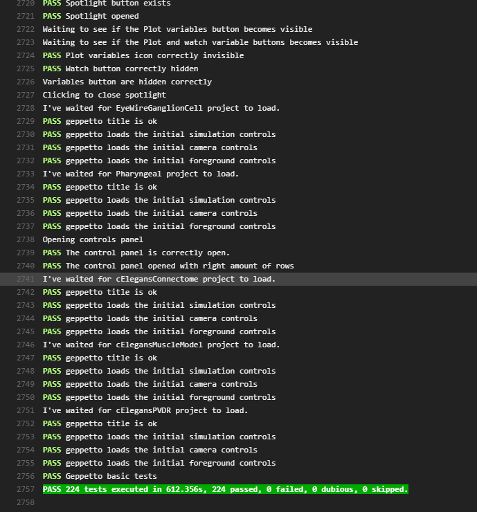

Running CasperJS Tests
===========

## Prereqs

* node.js
* npm

## Install with:

``` {.sourceCode .javascript}
npm install -g phantomjs casperjs slimerjs
```

## Run with (in this folder):

To test that Casper is properly installed:

``` {.sourceCode .javascript}
casperjs test LiveTests.js --engine=slimerjs
```

To run Core projects Tests (Requires NOT having the persistence bundle):

``` {.sourceCode .javascript}
casperjs test --includes=CoreTestsUtility.js CoreTests.js --engine=slimerjs
```

To run Persistence Tests (Requires the persistence bundle and a running MySQL server):

``` {.sourceCode .javascript}
casperjs test PersistenceTests.js --engine=slimerjs
```

If the tests were executed successfully and passed, you'll get something like this in your console.

:

## Settings and Errors

Tests are executed by default on port 8080. If you would like to execute tests on a different port, you can change it [here](https://github.com/openworm/org.geppetto.frontend/blob/development/src/main/webapp/js/pages/tests/casperjs/CoreTestsUtility.js#L1).

If you have an error similar to this one:
`Gecko error: it seems /usr/bin/firefox is not compatible with SlimerJS.`
It may be due to a new version of Firefox not supported by your current Slimer version. You have two options:
- Update Slimerjs and check if it supports latest FireFox
- Change application.ini maximum Firefox version parameter. [Reference](https://github.com/laurentj/slimerjs/issues/495#issuecomment-225008001)

## Adding New Tests
New Tests can be added to the Persistence or CoreTests files found [here](https://github.com/openworm/org.geppetto.frontend/blob/development/src/main/webapp/js/pages/tests/casperjs#L1).

The Persistence tests can only be executed with the persistence bundle on. These tests make sure that
the functionality for persisting projects/experiments works.

The Core tests don't need the persistence bundle. These tests are for general Geppetto functionality including:
UI performance, widgets, React components, camera controls and default Geppetto projects.

New tests must be encapsulated in casper functions like this:
``` {.sourceCode .javascript}
casper.then(function(){
	//test code
});
```
Only casper function calls can be made from here. To learn more about the tests calls that can be made
from here check out the [CasperJS Test API documentation](http://docs.casperjs.org/en/latest/modules/tester.html)

Calls to Geppetto code or JQuery must be encapsulated inside a casper evaluate function:
``` {.sourceCode .javascript}
casper.then(function(){
	var value = casper.evaluate(function() {
		//Geppetto Code or JQuery
	});
	//test code
});
```
The evaluate function returns a value, which can be used later for testing.
**Example:**
``` {.sourceCode .javascript}
casper.then(function(){
	var expectedVisibility = true;
	var visibility = casper.evaluate(function() {
		return Canvas1.engine.getRealMeshesForInstancePath(variableName)[0].visible;
	}, variableName);
	test.assertEquals(visibility,expectedVisibility,"Visibility correct");
});
```
In here we are testing the visibility of a 3D Mesh inside Geppetto. The call to Geppetto objects and
functions is done inside the evaluate method, which returns a boolean with the visibility of the mesh.
The return value is then used to test against the expected state.

## documentation

* [CasperJS Test API documentation](http://docs.casperjs.org/en/latest/modules/tester.html) - assert API
* [CasperJS Core API documentation](http://docs.casperjs.org/en/latest/modules/casper.html) - actions like clicks.
* [Additional command-line options for casperjs](https://docs.slimerjs.org/current/configuration.html#command-line-options) (these can go after `--engine=slimerjs`)
