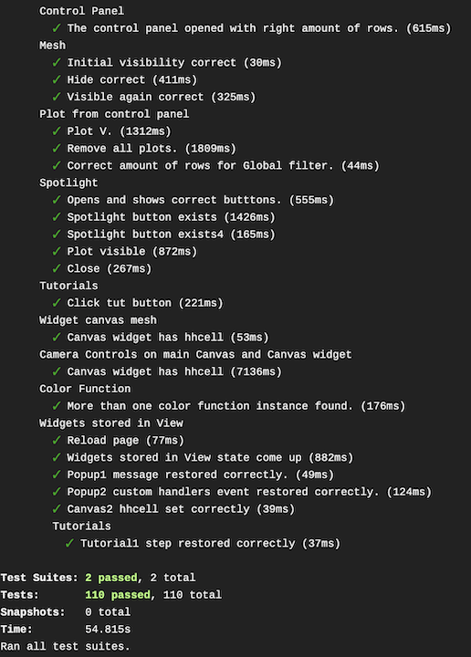

# Running e2e Tests

## Prereqs

* npm

## Install with

```javascipt
npm install jest@24.8.0 puppeteer@1.17.0 babel-preset-env@1.6.0 eslint-plugin-jest@22.6.4 jest-puppeteer@3.9.0
```

## Run with

To run the tests

```bash
# ./gepetto-application
npm run test
```

To run test with custom args

```bash
# ./gepetto-application
npm run test --url=https://localhost:8080/
```

* Read the argument in your script with

```javascript
// __tests__/Test1.js
import { getCommandLineArg } from './cmdline.js';

const baseURL = getCommandLineArg('--url', 'http://localhost:8080/org.geppetto.frontend');
```

To pass arguments to jest

* Everything after -- will be passed to jest.

```bash
npm run test -- --verbose --color
```

To run headless

* If you don't need to have a browser open when the test is running (example Travis-ci)

```javascript
// jest-puppeteer.config.js
module.exports = { launch: { headless: true }, }
```

To change test discovery rule

* By default we look for file names starting with the word *Test* inside folder \_\_tests\_\_

```javascript
// jest.config.js
module.exports = {
  "preset": "jest-puppeteer",
  "testRegex": "(/__tests__/Test.*|(\\.|/)(test|spec))\\.[jt]sx?$",
};
```

Output

If the tests were executed successfully and passed, you'll get something like this in your console.



## Puppeteer

What can I do?

Most things that you can do manually in the browser can be done using Puppeteer!

```javascript
const page =  await browser.newPage() // open a new tab.

await page.goto("https://www.google.com") // navigate to some webpage.

await page.click("#canvas") // click somewhere
```

## Jest

Jest is a delightful JavaScript Testing Framework with a focus on simplicity.

```javascript
test('Can I write a test?', () => {
    expect(
        2 > 1
    ).toBeTruthy()
});
```

## Jest + Puppeteer

The best of two worlds

```javascript
it('Correct number of children in Canvas1', async () => {
    expect(
        await page.evaluate( async () => $("#Canvas1").getChildren().length)
    ).toBe(4)
})
```

## Gotchas

* If you are planning to click an element 40 times, avoid using await on each single click and just do something along these lines:

```javascript
const repeat = Array(40).fill(1);

repeat.forEach(page => {
    page.click("#ElementID")
    page.waitFor(20)
})
```

Reason - To my best understanding: Chromium is implementing priority rules over visual objects and because tests are collected and run in parallel, execution for buttons with actions like zoom, pan, etc on tabs in background state are delayed until they regain focus.

* It is important to get familiar with Jest execution secuence:

```javascript
describe('This is the title for the collection of tests bellow', () => {
    it('I am Test number 1', async () => {
        console.log("1")
    })

    it('I am Test number 2', async () => {
        console.log("2")
    })

    console.log("3")
})
```

Will print

```undefined
3
1
2
```

Because

Everything outside `it()` is executed first.

* We cannot use functions to call `it()`

```javascript
const subTest = () => {
    it('I am the last Test', async () => {
        console.log("3")
    })
}

describe('This is the title for the test bellow', () => {
    it("This won't work because we are nesting tests", async () => {
        subTest()
    })

    it("I am Test number 1 because the previous one won't work", async () => {
        console.log("1")
    })

    subTest()
})
```

Will produce

```undefined
3
1
```

Because

`subtest` is used outside an `it()` function.


## Adding New Tests (old)

New Tests can be added to the Persistence or CoreTests files found [here](https://github.com/openworm/org.geppetto.frontend/blob/development/src/main/webapp/js/pages/tests/casperjs#L1).

The Persistence tests can only be executed with the persistence bundle on. These tests make sure that
the functionality for persisting projects/experiments works.

The Core tests don't need the persistence bundle. These tests are for general Geppetto functionality including:
UI performance, widgets, React components, camera controls and default Geppetto projects.

New tests must be encapsulated in casper functions like this:

```javascript
casper.then(function(){
    //test code
});
```

Only casper function calls can be made from here. To learn more about the tests calls that can be made
from here check out the [CasperJS Test API documentation](http://docs.casperjs.org/en/latest/modules/tester.html)

Calls to Geppetto code or JQuery must be encapsulated inside a casper evaluate function:

``` javascript
casper.then(function(){
    var value = casper.evaluate(function() {
        //Geppetto Code or JQuery
    });
    //test code
});
```

The evaluate function returns a value, which can be used later for testing.
**Example:**

```javascript
casper.then(function(){
    var expectedVisibility = true;
    var visibility = casper.evaluate(function() {
        return Canvas1.engine.getRealMeshesForInstancePath(variableName)[0].visible;
    }, variableName);
    test.assertEquals(visibility,expectedVisibility,"Visibility correct");
});
```

In here we are testing the visibility of a 3D Mesh inside Geppetto. The call to Geppetto objects and
functions is done inside the evaluate method, which returns a boolean with the visibility of the mesh.
The return value is then used to test against the expected state.

## documentation

* [Puppeteer-api](https://github.com/GoogleChrome/puppeteer/blob/v1.18.1/docs/api.md)
* [Puppeteer-docs](https://developers.google.com/web/tools/puppeteer/)
* [Jest](https://jestjs.io/)
