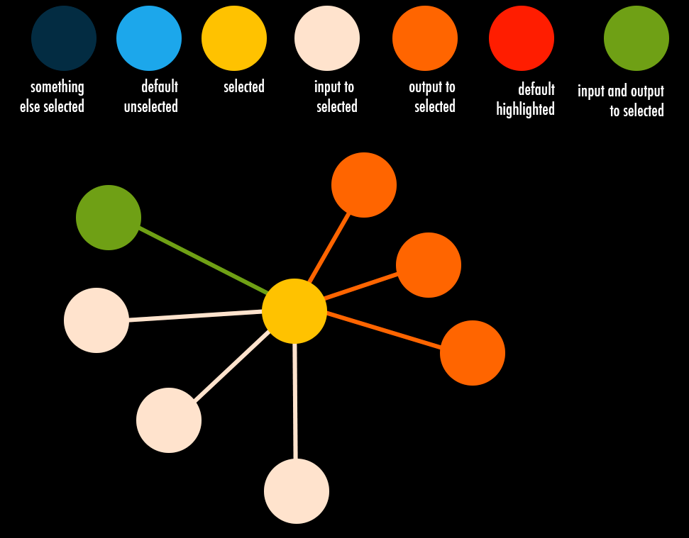

*************\* Visualizing Connections*************\* An entity can
specify multiple connections, input or output, to other entities and
sub-entities. Geppetto's ability to connect entities with a specific
orientation allows for any orientend graph to be represented. Extra
custom properties can be found inside the Connections and can be used to
store domain-specific data. Along with these custom properties, a
connection may also contain a list of visual references which are used
to store references to specific parts of entities that could, for
instance, visually represent a connection.

Getting Started
===============

The first step to visualize connections is to load a Simulation that has
connected entities. From our current samples list, the "C302
Experimental Network of integrate and fire neurons" model is a good
model to see connections in action.

Once you have a model loaded, you can click on the entities in the scene
(3D picking) to see any connections associated to the selected entity.
Clicking on an entity will select it; upon selection any connections
to/from other entities will be shown via entity color coding. The
selected entity color will change to yellow. Entities that have output
connections to a selected entity will change to orange while entities
that have input connections to a selected entity will change to a light
pink color. Those entities that have both input and output connections
will become green.

The picture below shows the color coding for the different kinds of
connections:



For example, consider a loaded simulation that has three entities: One,
Two and Three, where entity One has an input connection to entity Two
and an output connection to entity Three. If entity One is selected, its
color will change to yellow, entity Two will become light pink and
entity Three will turn orange.

Entity selection and connections visualization can also be accomplished
via the console. To visualize connections, select the entity by using
the "select()" command on it. To return the entity to its default color,
use the "unselect()" command. Refer to Console Commands for the rest of
available commands for connections.

By default, input and output connections are shown, but this can be
modified as explained in Changing Selection Options.

Console Commands ---------The whole set of commands for Connection are:

``` {.sourceCode .javascript}
-- Connection.getEntityInstancePath()

   -- Connection.getType()
      Gets type of connection

   -- Connection.highlight(mode)
      Highlights the connection

   -- Connection.getChildren()
      Gets all children of this connection 

   -- Connection.getCustomNodes()
      Gets all custom nodes for connection

   -- Connection.getVisualObjectReferenceNodes()
      Returns array of visual object reference nodes for this connection
```

Changing Selection Options ---------By default, selecting an entity
shows the connections it has to other entities. This can be changed by
using the command "Simulation.setOnSelectionOptions(options)", where the
options is an object that specifies different flags.

The options flags that can be given to the
"Simulation.setOnSelectionOptions()" command are:

*show\_inputs - Display input connections of selected
entity*show\_outputs - Display output connections of selected entity
\*hide\_not\_selected - Hides entities not selected

``` {.sourceCode .javascript}
Simulation.setOnSelectionOptions({show_inputs: true, show_outputs: false, hide_not_selected : true});
```

Highlighting Visual References ================= Connections can specify
visual references. Visual references are a way to associate a connection
to 3D objects in the scene. Usually they are used to provide a visual
representation of a connection in the 3D scene, but this decision is
left to the developer.

Visual references can be explored via console. Once the user navigates
to an entity connection, visual references can be found inside and can
be highlighted individually.

For instance, if the user wanted to highlight a single visual reference
associated to a given connection, this can be achieved by typing the
following in the Geppetto console:

``` {.sourceCode .javascript}
Entity.Connection.VisualReference.highlight(true);
```

This will highlight, by changing the color to red, the specific part of
the entity that is noted in the visual reference. To undo a highlight of
a visual reference, the user can use the same function, passing the
false flag instead:

``` {.sourceCode .javascript}
Entity.Connection.VisualReference.highlight(false);
```

If the user wants to highlight all visual references for a connection,
the following command should be entered in the Geppetto console:

``` {.sourceCode .javascript}
Entity.Connection.highlight(true);
```

Console Commands ---------The entire set of commands for visual
references are:

``` {.sourceCode .javascript}
-- VisualObjectReferenceNode.getAspectInstancePath()

-- VisualObjectReferenceNode.getVisualObjectID()

-- VisualObjectReferenceNode.highlight(mode)
```
