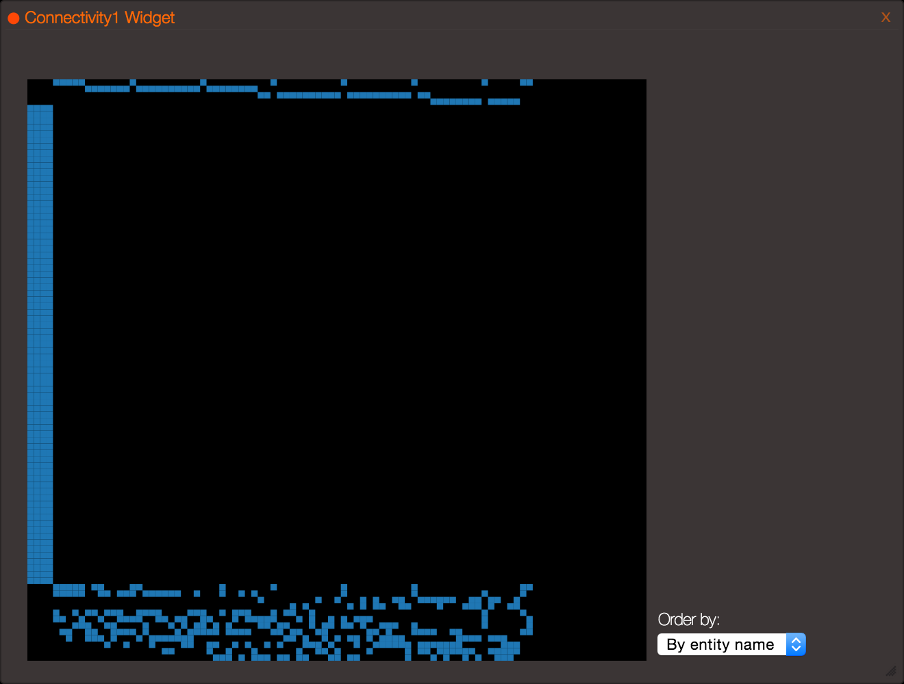
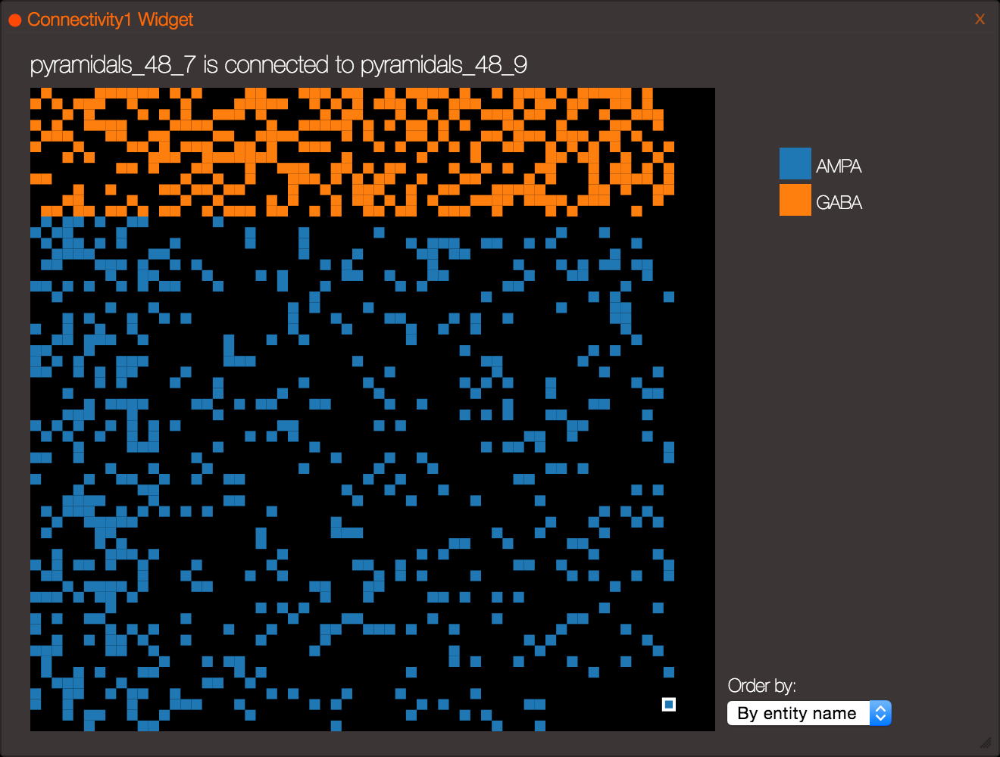
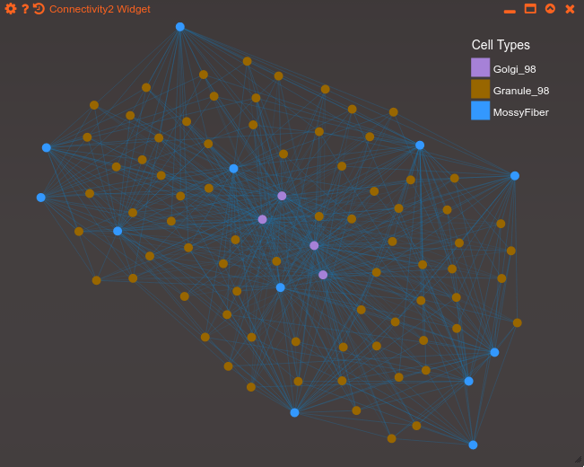
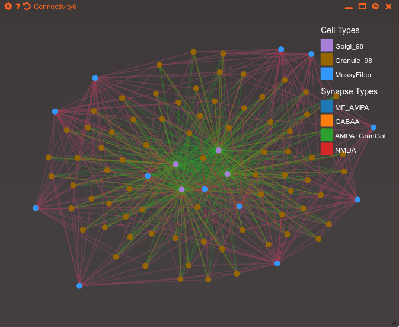
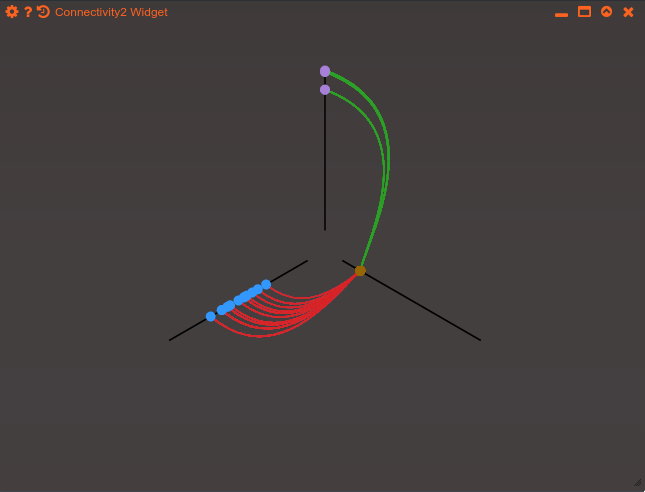
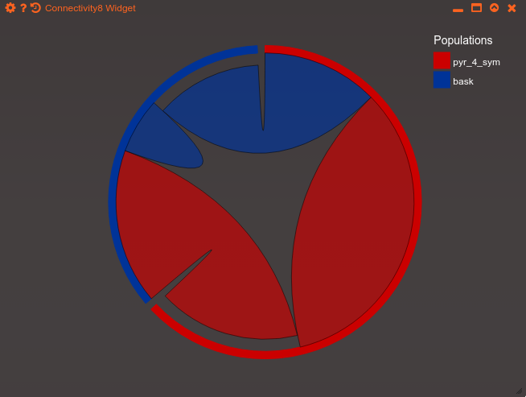

===================
Connectivity Widget
===================

The Connectivity Widget provides different ways to visualize connections between model entities. Data is bound to the widget by invoking the ``setData(entity[, options])`` method.  The way information is displayed is controlled via the *layout* field in the *options* object. Currently, four layouts are supported:

- 'matrix'(default): `Connectivity Matrix`_
- 'force': `Force-directed layout`_
- 'hive': `Hive Plot`_
- 'chord': `Chord Plot`_

Each one of the options is detailed below.

Layout agnostic options
=======================

After creating an instance of the Connectivity widget with ``G.addWidget(6)``, data must be bound to it using the ``setData()`` method, which applies to any of the layouts. Additional options for the same method can be used to control visual attributes  -- such as mapping link/node categories onto colours or node weights onto line widths -- in the following manner:

The ``setData(entity[, options])`` method accepts two arguments:

- *entity* (mandatory): the entity whose connections will be plotted.

- *options*: an object, containing the following fields:

  - *layout*: one of ['matrix', 'hive', 'force', 'chord']. Defaults to 'matrix'.

  - *linkType*: a function that maps each connection *edge* (object of class `ConnectionNode`_) onto *any* type of value (coercible to string) which qualitatively identifies the link category. Defaults to ``function(link): {return 1}`` (i.e., all links are of same 'type' 1). Applies to *matrix*, *force*, *hive* views.

  - *linkWeight*: a function that maps each connection *edge* (object of class `ConnectionNode`_) onto a Floating point number, which represents the connection weight. Defaults to ``function(link): {return 1}`` (i.e., all links are of same 'weight' 1, and will be e.g. be drawn as lines with the same width in the *force* view.

  - *nodeType*: a function that maps the connection *source node* (object of class `EntityNode`_ ) onto *any* type of value (coercible to string) which qualitatively identifies the node category. Defaults to ``function(node): {return node.getId().split('_')[0]}`` (i.e., nodes are classified according to part of their 'id' field before the first '_' character). Applies to *force*, *hive* views.

.. _`ConnectionNode`: https://raw.githubusercontent.com/openworm/org.geppetto.frontend/development/src/main/webapp/js/nodes/ConnectionNode.js
.. _`EntityNode`: https://raw.githubusercontent.com/openworm/org.geppetto.frontend/development/src/main/webapp/js/nodes/EntityNode.js

Connectivity Matrix
===================
Draws a square matrix_, where each row [column] correspond to a source [target] node. Therefore, filled squares at  *i,j* denote a directed edge from node *i*  to node *j*. The rows/columns can be sorted by node name, number of incoming connections, and number of outoing connections. Hover over to see node names, click to select the corresponding cells in the Geppetto 3d view.

.. _matrix: http://en.wikipedia.org/wiki/Adjacency_matrix

Example 1
---------
Connectivity widget for a cerebellar `granule cell layer model`_. It defaults to a vanilla matrix if no options are specified::

  G.addWidget(6).setData(cerebellum)

.. _`granule cell layer model`: http://opensourcebrain.org/projects/grancelllayer

Example 2
---------
Using the *linkType* option to colour links (synapses) by neurotransmitter in a model of the `auditory cortex`_. The *linkType* function leverages the *getSubNodesOfDomainType()* utility method, in order to get NeuroML synaptic properties, which in turn have and id attribute which indicates the neuromodulator (and the population, which is irrelevant in this case). The name is finally split at the underscore to get only AMPA/GABA. ::

  G.addWidget(6).setData(acnet2,
         {layout: 'matrix',
          linkType: function(l){ return l.getSubNodesOfDomainType('Synapse')[0].id.split('_')[0]}})

.. _`auditory cortex`: http://opensourcebrain.org/projects/acnet2

Force-directed layout
=====================
Draws circles for each node, connected by lines for each edge. Node / link colours and line widths can be customized via the *nodeType*, *linkType*, *linkWeight* mappings respectively. Nodes repel each other (`force directed`_) in order to reduce clutter, and can be interactively dragged. Hover over to see the node name.

Example 1
---------
Default force layout for the cerebellar `granule cell layer model`_. ::

  G.addWidget(6).setData(cerebellum, {layout: 'force'})

.. _`granule cell layer model`: http://opensourcebrain.org/projects/grancelllayer

Example 2
---------

Full usage of fore-layout customizations in the `granule cell layer model`_. Using the *linkType* option to colour links (synapses) by neurotransmitter, the *nodeType* option to colour nodes by type and the *linkWeight* option to scale line widths based on the synaptic base conductance level (which is NOT physiologically meaningful, but is used here just for illustrative purposes). ::

  G.addWidget(6).setData(cerebellum,
        {layout: 'force',
         linkType: function(l){return l.getSubNodesOfDomainType('Synapse')[0].id},
         nodeType: function(n){return n.id.split('_')[0]},
         linkWeight: function(l){return l.getSubNodesOfDomainType('Synapse')[0].GBase.value}})

.. _`force directed`: http://en.wikipedia.org/wiki/Force-directed_graph_drawing

.. _`granule cell layer model`: http://opensourcebrain.org/projects/grancelllayer

Hive Plot
=========

Depicts connectivity using a `hive`_ plot. Nodes are segregated by type into axes arranged radially, and edges are represented by lines. The position of a node in each of the axis is given by the node degree (indegree + outdegree for directed graphs, which is always the case in Geppetto).

Example 1
---------
Hive plot for the cerebellar `granule cell layer model`_. Link colours are customized via the *linkType* mapping. ::

  G.addWidget(6).setData(cerebellum, {layout: 'hive',
                        linkType: function(l){return l.getSubNodesOfDomainType('Synapse')[0].id}})

.. _`granule cell layer model`: http://opensourcebrain.org/projects/grancelllayer

.. _`hive`: http://www.hiveplot.net/

Chord Plot
==========
Draws populations as arcs of a circle, with connections represented as "chords" between populations. The arcs at the extremities of each chord indicate the number of nodes in each population projecting to the reciprocal population. Based (but using different conventions) on `Circos <http://circos.ca/intro/tabular_visualization/>`_.

Example 1
---------

Default force layout for the `auditory cortex model`_. ::

  G.addWidget(6).setData(acnet2, {layout: 'chord'})

.. _`auditory cortex model`: http://opensourcebrain.org/projects/acnet2
