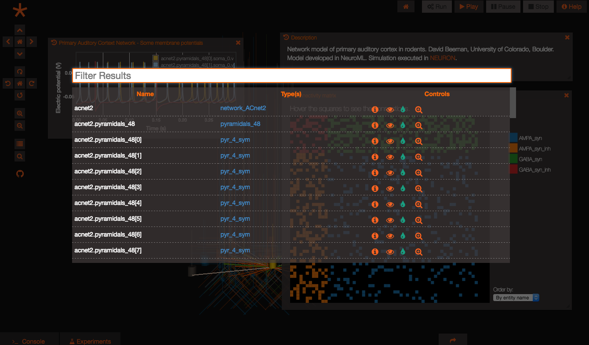

Control Panel Customization
===========================

The control panel (CTRL+P or the "rows" button on the left bar to open)
lets users see all visual entities at a glance in tabular form and
offers default actions.



The control panel can be configured via API to:

-   Display custom columns
-   Configure which custom controls to show for each row and associate
    actions to them
-   Set data filters

Display custom columns
----------------------

Columns can be controlled by setting column metadata, as in the
following example:

``` {.sourceCode .javascript}
var customColumnMeta = [
    {
        "columnName": "path",
        "order": 1,
        "displayName": "Path",
        "source": "$entity$.getPath()"
    },
    {
        "columnName": "name",
        "order": 2,
        "displayName": "Name",
        "source": "$entity$.getPath()"
    },
    {
        "columnName": "type",
        "order": 3,
        "customComponent": GEPPETTO.ArrayComponent,
        "displayName": "Type(s)",
        "source": "$entity$.getTypes().map(function (t) {return t.getPath()})",
        "action": "G.addWidget(3).setData($entity$).setName('$entity$')"
    },
    {
        "columnName": "controls",
        "order": 4,
        "customComponent": GEPPETTO.ControlsComponent,
        "displayName": "Controls",
        "source": "",
        "action": "GEPPETTO.FE.refresh();"
    }
];

GEPPETTO.ControlPanel.setColumnMeta(customColumnMeta);
```

The non-self-explanatory fields are explained below:

-   customComponent: for data that is not simple text, custom components
    can be used among those available (list below)
-   source: where to get the data, where \$entity\$ represent the entity
    for the given row
-   action: columns that use custom components may have configurable
    actions, this varies depending on the custom component

Custom components
-----------------

Here's a list of available custom components:

-   GEPPETTO.ArrayComponent: displays an array as comma separated
    clickable items. the action on click comes from the action parameter
    in the column metadata.
-   GEPPETTO.ControlsComponent: displays custom controls in the form of
    buttons based on controls configuration (see next section). The
    action here represent a snippet that runs AFTER the action
    configured in the control configuration runs (useful to trigger
    refresh actions when something changes).
-   GEPPETTO.ImageComponent: displays a thumbnail image, with enlarged
    preview on hover

Configure custom controls
-------------------------

Custom controls can be configured as follows:

``` {.sourceCode .javascript}
var myControlsConfiguration = {
"VisualCapability": {
    "visibility": {
        "condition": "GEPPETTO.SceneController.isVisible($instances$)",
        "false": {
            "id": "visibility",
            "actions": [
                "GEPPETTO.SceneController.show($instances$);"
            ],
            "icon": "fa-eye-slash",
            "label": "Hidden",
            "tooltip": "Show"
        },
        "true": {
            "id": "visibility",
            "actions": [
                "GEPPETTO.SceneController.hide($instances$);"
            ],
            "icon": "fa-eye",
            "label": "Visible",
            "tooltip": "Hide"
        }
    },
    "color": {
        "id": "color",
        "actions": [
            "$instance$.setColor('$param$');"
        ],
        "icon": "fa-tint",
        "label": "Color",
        "tooltip": "Color"
    },
    "zoom": {
        "id": "zoom",
        "actions": [
            "GEPPETTO.SceneController.zoomTo($instances$)"
        ],
        "icon": "fa-search-plus",
        "label": "Zoom",
        "tooltip": "Zoom"
    }
},
"Common": {
    "info": {
        "id": "info",
        "actions": [
            "G.addWidget(1).setData($instance$)"
        ],
        "icon": "fa-info-circle",
        "label": "Info",
        "tooltip": "Info"
    }
}
};

GEPPETTO.ControlPanel.setControlsConfig(myControlsConfiguration);
GEPPETTO.ControlPanel.setControls({"Common": \['info'\],
"VisualCapability": \['visibility', 'zoom'\]});
```
Controls can be grouped by capabilities. If an entity has a given
capability (VisualCapability in the example above), the controls will be
added. All controls specified under "Common" will be added for all the
rows regardless of capabilities. The setControlsConfig command set the
configuration, while the .setControls command controls which items will
be visible (this can be dynamic).

Set data filter
---------------

A filter function can be configured to control what entities gets
displayed in the grid.

The example shown below illustrates how to show in the control panel
only instances of composite types:

``` {.sourceCode .javascript}
var myFilter = function(entities){
    var visualInstances = GEPPETTO.ModelFactory.getAllInstancesWithCapability(GEPPETTO.Resources.VISUAL_CAPABILITY, entities);
    var compositeInstances = [];
    for(var i=0; i<visualInstances.length; i++){
        if(visualInstances[i].getType().getMetaType() == GEPPETTO.Resources.COMPOSITE_TYPE_NODE){
        compositeInstances.push(visualInstances[i]);
        }
    }
    return compositeInstances;
};

GEPPETTO.ControlPanel.setDataFilter(myFilter);
```

Refreshing the control panel
----------------------------

All the API methods that change the state of the control panel cause the
control panel to re-render so it not necessary to trigger manual
refresh when interacting with the control panel via the API.

However if something has changed in the state of the instances and the
control panel hasn't been closed and re-opened a manual refresh can be
triggered via script:

``` {.sourceCode .javascript}
GEPPETTO.ControlPanel.refresh();
```

What Next?
----------

Backlog:

-   Share capabilities based configuration with the spotlight

