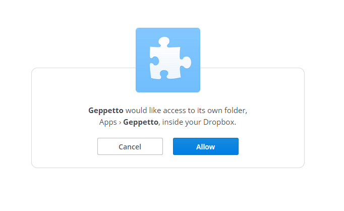

*************************
Geppetto and Dropbox 
*************************

 * Linking Geppetto to Dropbox
 * Uploading experiment results to dropbox

Linking Geppetto to Dropbox
=================
Geppetto can be linked to your dropbox account via console's command. 

Run command: 

.. code-block:: javascript

	G.linkDropBox();
	
A new tab/window will be open asking you to grant Geppetto privileges to access your 
DropBox folder, which is needed to upload experiment results.

After clicking "Allow", you will be presented with a code. Copy and paste that code, 
and run command G.linkDropBox() again. This time put the key code inside the command as 
a parameter, in between brackets, as in example below.

.. code-block:: javascript

	G.linkDropBox("place_key_code_here");

If all goes well, console will print out a message saying link to DropBox was successful.
	
Uploading experiment results to dropbox
=================
Experiment results can be uploaded to your dropbox account, after doing link steps from section 
above. An experiment must be set to active, and be in COMPLETED state in order to upload results.
You will need to know id of experiment, aspect path where results are stored, and the format 
of the results you wish to upload
Example of command below, remember to replace parameters and experiment id for whatever you 
need it to be:

.. code-block:: javascript

	Project.getExperiments()[1].uploadResults("hhcell.electrical","RECORDING");
	