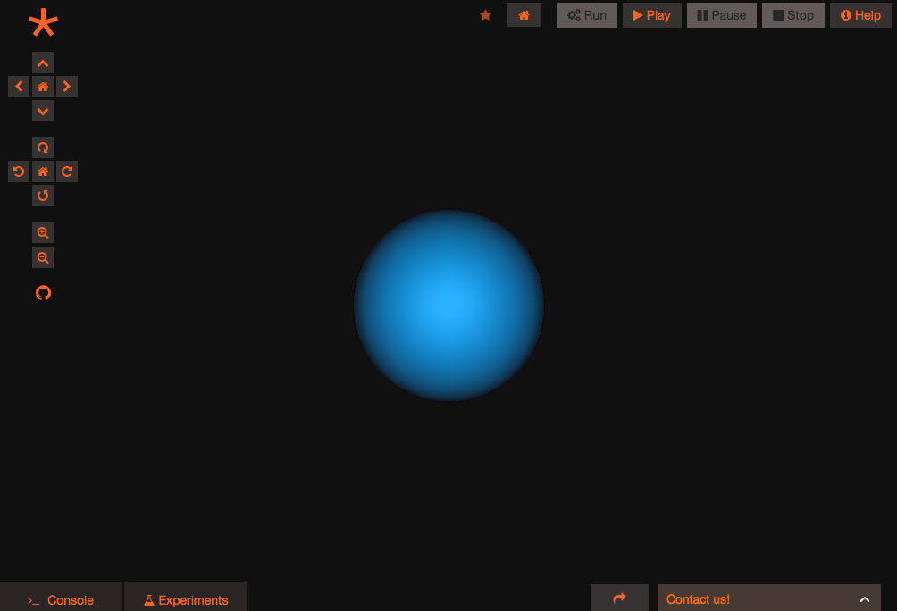

# The Geppetto Model explained

This section explains the Geppetto Model abstraction, its role in
Geppetto, and how it can be used to provide support for additional
domain-specific formats. In other words, being able to extract
information from domain-specific content (e.g. native input files for a
given simulator) and interact with that information within Geppetto.

The Geppetto Meta-Model is defined in a declarative way using Ecore, a
tool for building meta-models from the Eclipse Modeling Framework (EMF).
Introductory documentation for EMF can be found at the [eclipse project
website](http://www.eclipse.org/modeling/emf/docs/?).

## Main concepts

Every project that is loaded in Geppetto has a **Geppetto model** associated
to it. The Geppetto Model is a dynamic typed abstraction of the data structures we need for
our project.
In other words, Geppetto imports the project specific data into a model with
fully typed object descriptions.

When the frontends loads a project, the model (coming from the backend) is loaded;
while loading the model, the declared variables
are instantiated with the default values which are specified in the model.
The model comes with a full-featured reflection mechanism, which allows to inspect
and instantiate values through the Meta-Model specification.

### Why the Geppetto Model Abstraction?
Geppetto was born from the need of describing computational models coming from neuroscience.
In this context, each model has its own structure and values that can evolve during 
the experiments we are running upon the model.

#### The Geppetto Model is dynamic
We can represent the model with the usual tools
that we use in programming to represent data structures: variables, classes, values, parameters
within a life cycle in which variable values can change and can be represented visually.

Nothing that we cannot do with any programming language, except the fact that all of this 
definitions in Geppetto are made *dynamically*: when we load a model, we are defining
a complete new set of typed data structures based on the Geppetto Meta-Model.
We have no limits on the models we can define, still having a fully typed model
system.


#### The Geppetto Model is fully serializable
The Geppetto Model can be serialized and is shared and synched between the backend and
the frontend of the application.


#### The Geppetto Model is typed
There are simpler ways than the Geppetto Model to defined dynamic structures.
For instance, we could define variables with any structure with a JSON markup.
JSON markup is not typed though. When we parse a JSON markup we must implicitly
know its semantics and write a specific manipulation logic consequently.
By defining the types we are kind of declaratively programming the visualization
and behaviours which can be automatically associated to the data through Geppetto
apis and components.
For example, a visual type can be visualized on the canvas, time series can be plotted, etc.
On the frontend, instances of different types can have different ***capabilities***,
i.e. actions that can be activated from the variables of that types.

### Geppetto Meta-Model
The Geppetto Meta-Model is a description of what can be
found inside a Geppetto model, hence the "meta".
The main concepts to
understand from the Geppetto Meta-Model are **Type**, **Variable** and **Value**,
and they will be familiar to pretty much every developer.
A Geppetto model defines variables, which at some point will be instantiated;
each variable has a value and a
type. With the use of composite types we can define complex data structures.

#### Type
A ***Type***
represents the structure of an entity and therefore defines something that
can be associated to one of multiple variables. In modern programming
languages this same concept is often referred to as ***Class***. 

There are
different built-in types defined in the Geppetto Meta-Model; the
**CompositeType** allows the developer to specify structured types with one or more variables.

Every type belongs to the Geppetto **library** which contains it.

#### Variable
A variable represents an
instance of a given type. This concept exists in every programming
language. 
Every variable knows its type and initial value.

#### Value
A value is something that can be assigned
to a variable or to a type (the default value) a concept that once again
exists in every programming language. There are different kinds of values
defined in the Geppetto meta-model and every existing type has pretty
much one or more corresponding values defined.

### Model at runtime

The Geppetto model is created on the backend usually from a EMF specification file (xmi).
Domain specific Geppetto types and values are created dynamically at runtime from possibly any file format provided a **Model Interpreter** is available for that format.

Upon receiving a Geppetto Model from the backend, when loading a given Geppetto Project, the frontend will instantiate it.

Instantiated Geppetto Types are mapped to JavaScript objects (e.g. a population of one cell Type would become a JavaScript array containing Instances of that Type) and augmented with specific Capabilities which confer on them the ability to be accessed via a specific API. 
 
#### Instances

Variables are defined with a type and a default value. When the Geppetto model
is loaded on the frontend its top-level variables are instantiated (the model is only instantiated in the client).
Every instance knows its value and variable, each variable knows its type(s).
A type in turn may contain multiple variables (as is the case of CompositeType) 
that can be instantiated. The instantiation of inner variables is done on demand
at runtime when needed.

For example, let's start from a model having a top level variable x of type T. The 
type T is a CompositeType defining the variables t1 and t2.
When the model is loaded we will have an instance called `x` on our Geppetto runtime.
So we can:
* Use that instance `x` in the Geppetto console
* Access the instance through the global Javascript variable `x`
* Create the instance from Javascript through `Instances.getInstance('x')`
* Create the instance from Javascript through `Instances.getInstance('x.t1')`
* Use the instance sub variables through `x.t1`, `x.t2` from the Geppetto console 

Note that we are not guaranteed to access `x.t1` from Javascript until 
`Instances.getInstance('x.t1')` is invoked: sub instances are created on demand.

#### Capabilities
The client will inject *Capabilities* to an instance depending on their type. 
A capability will confer to the Javascript object an API to interact with the 
specifics of its type. Thus we have type-specific methods as in OOP languages.

So, for instance, if a Model Interpreter in the backend defined a custom Type including a State Variable, upon instantiation in the frontend, this would become a JavaScript object with an injected StateVariableCapability containing methods specific for state variables, e.g. getUnit(), getInitialValue(), etc.

This has the advantage of giving developers the ability to build UI components that can interact with the Geppetto Model in an object-oriented way, and allow all the user operations to be fully scriptable, reproducible and testable (e.g. a UI button designed to plot a state variable would call `Plot.plotData(myStateVariable.getTimeSeries()`). The same principles apply when a custom Type defining a cell morphology (Values like Sphere and Cylinder are available to this end in the Geppetto Model Abstraction) is sent to the frontend and passed to the 3D Canvas component using its API for display.

#### Instances and UI Components: behaviours
Some UI component are initialized from instances and use their knowledge of the types and the
capabilities to initialize the visualization or other behaviours.

* **ControlPanel**: loads by default all Instances of type VisualType
* **Canvas**: shows Instances of type VisualType on the 3D Canvas

[comment]: <> (TO be completed)


## Working on the backend
Let's have a look at some
examples that will show how the model abstraction can be used in
practice. In these examples we will use the JAVA API that is generated
for us by EMF to create the models.

### Creating a cell

Let's say we want to create a simple type that represents a biological
cell. What would we need to do?

``` {.sourceCode .java}
SimpleType cellType = TypesFactory.eINSTANCE.createSimpleType();
cellType.setId("cell");
cellType.setName("Cell");

GeppettoLibrary myLibrary = GeppettoFactory.eINSTANCE.createGeppettoLibrary();
myLibrary.setId("myLibrary");
myLibrary.getTypes().add(cellType);
```

That's easy right? With these three simple lines we are creating a new
simple type in Geppetto. A simple type only has a name, what will be
displayed in the UI, and an id which is what will be used every time we
want to access the type. We have then added our brand new type to a
brand new library we created. If we were to feed this model to Geppetto,
the type with its two fields contained inside "myLibrary" is what we'd
see. Let's see how difficult it is to see a Sphere in the Geppetto 3D
canvas when we instantiate our cell.

The first thing we want to get a handle on is what we call a VisualType. A
VisualType tells Geppetto that something can be visualised and comes
from inside the Geppetto Common Library. The Geppetto Common Library is
a collection of types that Geppetto instantiates by default and that can
be used by every domain and application. It is no different from the
"myLibrary" we created above, only this one comes from Geppetto.

``` {.sourceCode .java}
VisualType visualType = (VisualType) commonLibrary.getType(TypesPackage.Literals.VISUAL_TYPE);

Variable soma = VariablesFactory.eINSTANCE.createVariable();
soma.setId("soma");
soma.getTypes().add(visualType);

Sphere sphere = ValuesFactory.eINSTANCE.createSphere();
sphere.setRadius(10);
Point origin = ValuesFactory.eINSTANCE.createPoint(); //x=0,y=0,z=0 by default
sphere.setPosition(origin);

soma.getInitialValues().put(visualType, sphere);

CompositeVisualType morphology = TypesFactory.eINSTANCE.createCompositeVisualType();
morphology.setId("morphology");
morphology.getVariables.add(soma);

cellType.setVisualType(morphology);
```

So what have we done? We have created a variable we called "soma" and we
have made it of type **VisualType**, reusing what comes from the
commonLibrary. We have created a Sphere which is one of the VisualValues
available through the Geppetto Model, we gave it radius 10, and we placed
it at the origin of our scene. We have then assigned this sphere as the
initial value of our variable soma. What we created next is
"morphology", a CompositeVisualType to which we have added the soma we
just created. The last line assigns this morphology to the cell we
created. What would we see if we were to feed this type to the frontend?



That looks good! However you might be wondering, "Why are we seeing
anything on screen at all? We just created a cellType; nobody
instantiated anything. You said this was going to be like any other
programming language!" Which is all correct: you need to instantiate a
type if you want it to come into existence, and that is what we did.
We just haven't shown you yet. Here is how you do it:

``` {.sourceCode .java}
Variable myCell = VariablesFactory.eINSTANCE.createVariable();
myCell.setId("myCell");
myCell.getTypes().add(cellType)

geppettoModel.getLibraries().add(myLibrary);
geppettoModel.getVariables().add(myCell);
```

So this is how you instantiate something, just as you'd expect. We
create a variable of the type that we want, cellType in this case, and we
add it at the root level in the geppettoModel, which in this case
represents the Java object of our Geppetto Model.

## Working on the frontend

### Visual variables

### Javascript APIs

#### Instances

Instances is a global service which allows to extract instances from the model.
An instance is a wrapper for available with inspection capabilities: from an instance we can start the inspection of everyhting that is below.

* `Instances.getInstance(variablePath)`: allows to instantiate a variable if not already instantiated and returns it. After an instance is created it can be accessed from the global scope through its variable name
* `myInstance.getVariable()`: returns the variable definition for the instance, starting inspection. A typical use is `myInstance.getVariable().getType().getVariables()`, which gives all the available fields for that instance.
* `myInstance.getPath()`: gets the full path within the model

##### State variable capability
* `myInstance.getValue()`: returns the actual value for that instance

#### Values
##### ImportValue
* `myValue.resolve(callback)`: resolves the current value on runtime

...

#### Variables
...

#### Manager
...

#### ModelFactory

* `GEPPETTO.ModelFactory.allPaths`: gets all paths available on the current model


# Geppetto Meta-model EMF library
**Why EMF?** 
The Eclipse Modelling Framework is an industry grade technology which
has been around for more than 15 years and is currently used in thousands
of professional software and tools. Ecore allows the developer to
specify all the entities (called EClass) and relationships that exist in
a given meta-model allowing the developer to define all the constraints
(e.g. containment, hierarchy, boundary conditions, etc.) that exist in
the model in a declarative way. EMF adds the ability to generate, from
the model definition, the code to use the model in a multitude of
languages, making pretty much every line of model-related code bug free.
EMF supports XMI, a dialect of XML, as default serialization standard,
making it easy to serialize and deserialize models in a robust way,
performing a validation against the schema through every step of the
process. Geppetto also takes advantage of EMF-JSON, an extension that makes
it possible to serialize the models to JSON as well.
## Model

This is the top-level package and it contains many of the Geppetto
abstractions.


GeppettoModel is the EClass that represents the top level node of a
Geppetto Model. Node is an abstract EClass, extended by many entities,
which gives the ability to associate an id, a name and a set of Tags to
every entity. The Geppetto Library is simply a container for types. In a
Geppetto Model there can be one or multiple libraries defined.

## Types

This package contains the definition of all the types defined in the
Geppetto Meta-model.


An abstract type, simply called Type, is defined and is extended by
every existing type. Every Type can have zero or many superTypes
(multiple hierarchy that is), an optional VisualType (which specifies
how that type can visualised in the 3D environment) and an optional
DomainModel (to specify what domain is declaring that particular type).

The Geppetto Meta-model defines a set of types to represent dynamic
systems. These types can be used by every developer that wishes to extend
Geppetto to add support for a particular modeling specification.

StateVariableType and
ParameterType define, respectively, a state variable and a parameter of a
system. Dynamics describes the dynamics of the system specifying a
Function and a PhysicalQuantity as initalCondition. A Function is
defined as an Expression and a list of Arguments.

An ArrayType defines a type that when instantiated will result in multiple instances of the type of the array to be created. After instantiation each element of the array can be accessed through an index. The type of the Array can be any Geppetto Type. A
VisualType is an abstract EClass that defines a particular kind of type
that can be visualised in the 3D environment. A VisualType only allows
for a VisualValue to be associated to it (e.g. a Cylinder, a Sphere, an
OBJ, etc.).

## Values

This package contains the definition of all the values that can be
associated to variables and types.


A Quantity defines the result of a measure. When we associate a Unit to
a Quantity we obtain a PhysicalQuantity.
A special mention to CompositeValue that defines a structure value that
can be assigned to a variable of type CompositeType. VisualValues can be
assigned to variables of type VisualType. ArrayValues can be assigned to
variables of type ArrayType and specifies the index for each one of the
individual values.

## Variable

This package contains the definition of the variable EClass.


# Advanced 

## Multi-scale definition
Geppetto allows a ***variable*** to instantiate one or multiple
types, a feature that makes it possible to support multi-scale
definitions (imagine a variable that at one scale is defined simply as a
parameter and at another scale is mapped to a whole computational model
with sophisticated dynamics).
