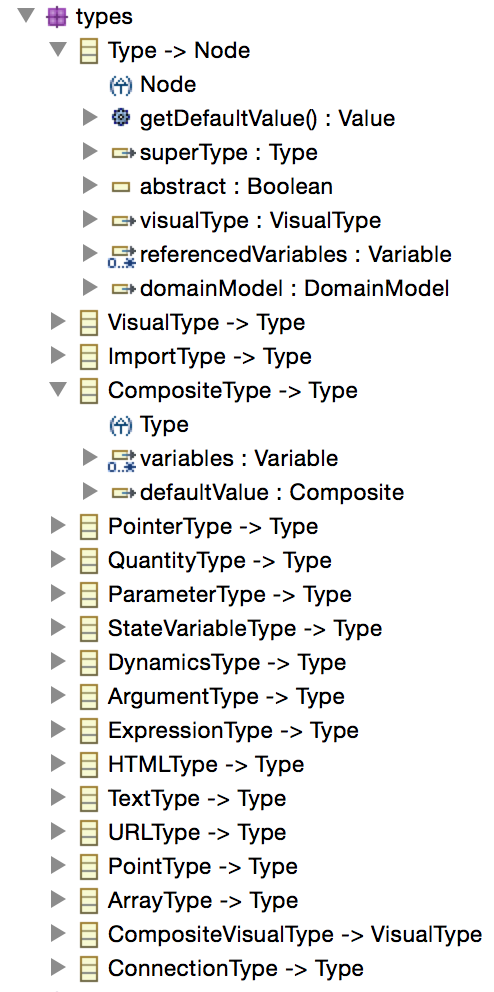
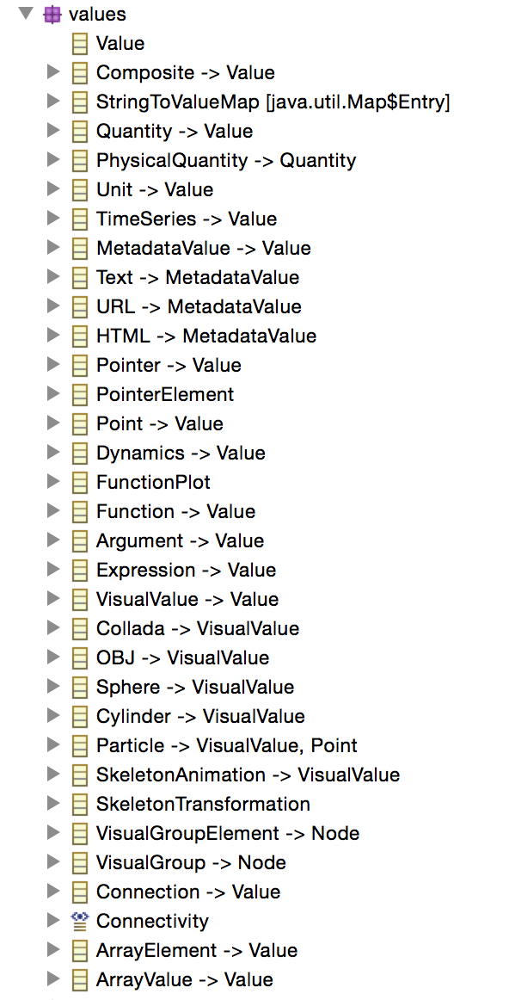

***********
Geppetto Meta-Model 
***********

This section explains the Geppetto Model abstraction, what is its role in Geppetto and how it can be used to add support for new formats.

The Geppetto Meta-Model is defined in a declarative way using Ecore, a tool for building meta-models from the Eclipse Modeling Framework.

**Why EMF?**

The Eclipse Modelling Framework is an industry grade technology which has been around for more than 15 years and is currently used in thousand of professional software and tools.
Over the years EMF has solved pretty much every problem related to modeling providing a very generic and powerful abstraction which allows to define meta-models in a  simple and powerful way.
Ecore allows the developer to specify all the entities (called EClass) and relationships that exist in a given meta-model allowing the developer to define all the constraints (e.g. containment, hierarchy, boundary conditions, etc.) that exist in the model in a declarative way.
EMF adds the ability to generate, from the model definition, the code to use the model in a moltitude of languages, making pretty much every line of model-related code bug free.
EMF supports XMI, a dialect of XML, as default serialization standard, making it easy to serialize and deserialize models in a robust way, performing a validation against the schema through every step of the way.   
Geppetto takes advantage also of EMF-JSON an extension that makes it possible to serialize the models also to JSON.
For more information about Ecore and EMF see this link.

**Main concepts**

Every project that is loaded in Geppetto has a Geppetto model associated to it, the Geppetto Meta-Model is simply a description of what can be found inside a Geppetto model, hence the "Meta".
The main concepts to understand from the Geppetto Meta-Model are Type, Variable and Value, and they will be familiar to pretty much every developer.
A Type represents the structure of an entity therefore defines something that can be associated to one of multiple variables. In modern programming languages this same concept is often referred to as Class.
There are different kind of types defined in the Geppetto meta-model; the CompositeType allows the developer to specify structured types which contain one or more variables inside it.
A variable represents an instance of a given type. This concept exists in every programming language. Geppetto allows a variable to instantiate one or multiple types, a feature that makes it possible to support multi-scale definitions (imagine a variable that at one scale is defined simply as a parameter and at another scale is mapped to a whole computational model with sophisticated dynamics).
A value is something that can be assigned to a variable or to a type (the default value) a concept that once again exists in every programming language. 
There are different kind of values defined in the Geppetto meta-model and every existing type has pretty much a corresponding value defined. 

These are the main concepts to understand, let's have a look now at some more details looking at the Geppetto Meta-model ecore and at the four packages there defined.
We'll describe, inside each package, the main entities that are defined.

**Model**

This is the top-level package and contains many of the Geppetto abstractions. 

.. image:: images/model/model.png

GeppettoModel is the EClass that represents the top level node of a Geppetto Model.
Node is an abstract EClass, extended by many entities, which gives the ability to associate an id, a name and a set of Tags to every entity.
The Geppetto Library is simple a container for types. In a Geppetto Model there can be one or multiple libraries defined.

**Types**

This package contains the definition of all the types defined in the Geppetto Meta-model.

 
An abstract type, simply called Type, is defined and is extended by every existing type.
Every Type can have zero or many superTypes (multiple hierarchy that is), an optional VisualType (which specifies how that type can visualised in the 3D environment) and an optional DomainModel (to specify what domain is declaring that particular type). 

The Geppetto Meta-model defines a set of types to represent dynamic systems. These types can be used by every developer that wish to extend Geppetto to add support for a particular modeling specification.

A Quantity defines the result of a measure. When we associate a Unit to a Quantity we obtain a PhysicalQuantity.
StateVariableType and ParameterType define respectively a state variable and a parameter of a system.
Dynamics describes the dynamics of the system specifying a Function and a PhysicalQuantity as initalCondition.
A Function is defined as an Expression and a list of Arguments. 

An ArrayType defines a type that when instantiated will result 
A VisualType is an abstract EClass that defines a particular kind of type that can be visualised in the 3D environment. A VisualType only allows for a VisualValue to be associated to it (e.g. a Cylinder, a Sphere, an OBJ, etc.).
 

**Values**

This package contains the defintion of all the values that can be associated to variables and types.

A special mention to CompositeValue that defines a structure value that can be assigned to a variable of type CompositeType.
VisualValues can be assigned to variables of type VisualType.
ArrayValues can be assigned to variables of type ArrayType and specifies the index for each one of the individual values.

**Variable**

This package contains the definition of the variable EClass.

.. image:: images/model/variables.png

 