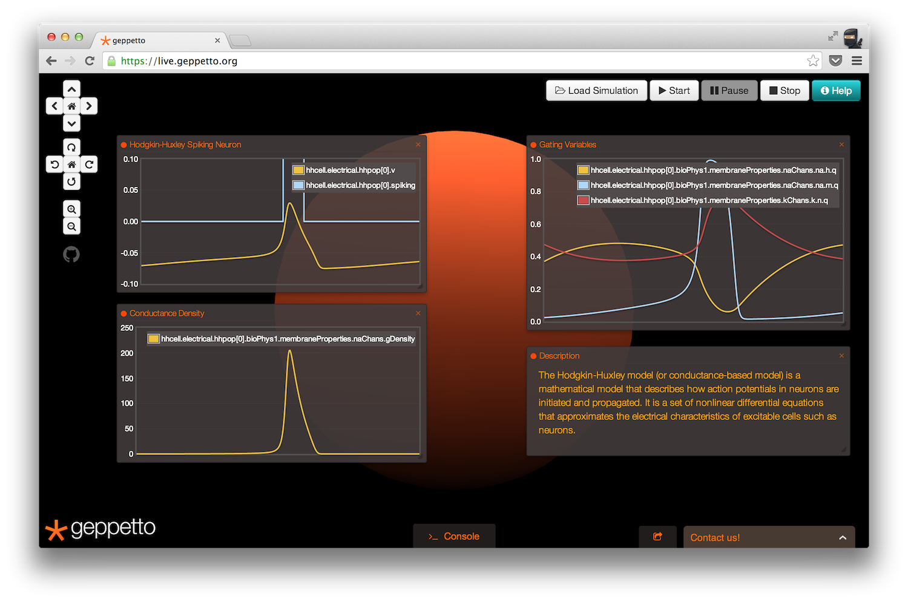
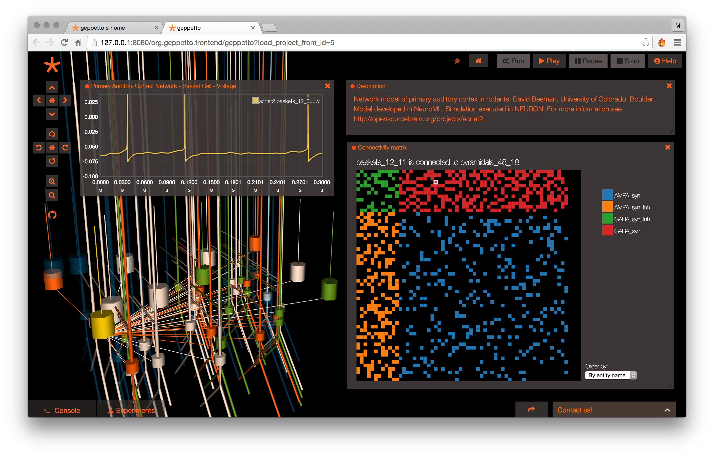
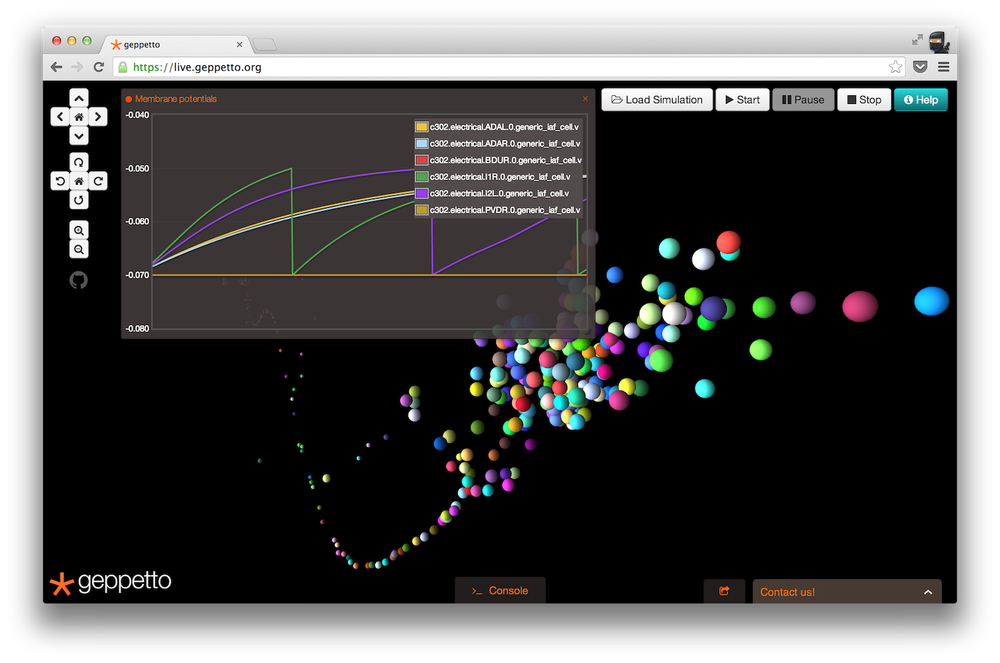
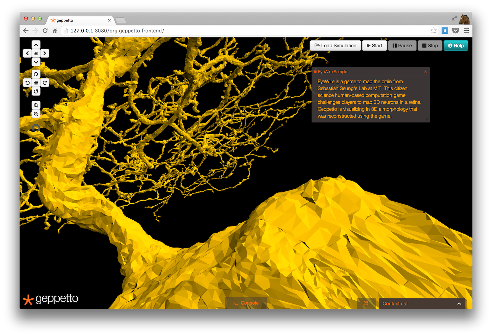
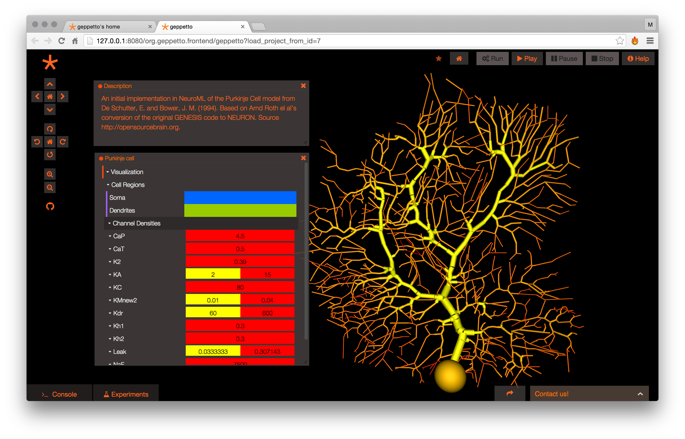
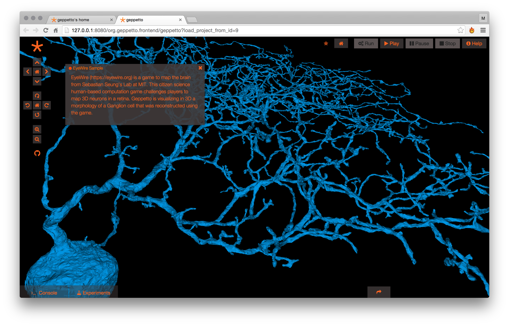

Introduction
============

Geppetto is a web based platform made to empower you to **explore, visualize and simulate complex biological models** such as a **cell** or even a **whole brain**.

Geppetto's goal is to make it easy to work in an integrated fashion with different types of data, whether they come from a simulation, an experiment or a clinical study.

Since Geppetto is a web application users don't need to install it in order to use it, however private and local deployments are also possible.

A demo deployment of the latest release of Geppetto is available `here <https://live.geppetto.org>`__ while the binaries are available to `download here <https://github.com/openworm/org.geppetto/releases/>`__.

The documentation is split into two main sections: a guide to help you learn how to use Geppetto and the developers documentation to learn how Geppetto is engineered and how to contribute to it.

------------

------------

------------

Contributions
=============

Geppetto is open source, released under the MIT license.

Geppetto is currently used and contributed to by the following groups:

* `Wellcome Trust <http://www.wellcome.ac.uk/>`__ via the `Open Source Brain <http://www.opensourcebrain.org/>`__ initiative (`Silver Lab, University College London <http://www.ucl.ac.uk/silverlab/>`__ )
* `Wellcome Trust <http://www.wellcome.ac.uk/>`__ via `Virtual Fly Brain <http://www.virtualflybrain.org/>`__  (`Institute for Adaptive and Neural Computation, University of Edinburgh <http://http://www.anc.ed.ac.uk/>`__ , `Department of Genetics, University of Cambridge <http://www.gen.cam.ac.uk/>`__ , `MRC Laboratory of Molecular Biology, Cambridge <http://www2.mrc-lmb.cam.ac.uk/>`__ , `European Bioinformatics Institute (EMBL-EBI) <http://www.ebi.ac.uk/>`__ )
* `OpenWorm <http://www.openworm.org/>`__
* `MetaCell <http://metacell.us>`__
* `Orion Bionetworks <http://www.orionbionetworks.org/>`__

The following is a list of the websites currently using a custom deployment of Geppetto available on the web:

- `Open Source Brain <http://opensourcebrain.org>`__
- `WormSim <http://wormsim.org>`__
- `Virtual Fly Brain <http://virtualflybrain.org>`__

------------

Contact us
==========

You can reach out to us at info@geppetto.org.

`Website <http://geppetto.org>`__ | `GitHub <http://git.geppetto.org>`__ | `Development Board <http://board.geppetto.org>`__

Follow us on `Twitter <https://twitter.com/GeppettoEngine>`__ and on our `Blog <http://blog.geppetto.org>`__!

Screenshots
===========

**Screenshot 1** - Visualization of the drosophila fly brain superposing anatomy and segmented neurons (Model source `Virtual Fly Brain <http://virtualflybrain.org/>`__ )

**Screenshot 2** - Simulation using NEURON of a model of the Auditory Cortex from David Beeman, University of Colorado (Model source `Open Source Brain <http://opensourcebrain.org/>`__ )

**Screenshot 3** - Simulation of a single compartment Hodgkin-Huxley neuronal model in `NeuroML <http://neuroml.org/>`__ (Model source `Open Source Brain <http://opensourcebrain.org/>`__ )

**Screenshot 4** - Simulation of a network of single compartment neurons for the C.elegans built by the OpenWorm project.

**Screenshot 5** - Visualisation of a Purkinje cell in `NeuroML <http://neuroml.org/>`__ from `Open Source Brain <http://opensourcebrain.org/projects/purkinjecell>`__

**Screenshot 6** - Visualisation of the realistic morphology of a Ganglion cell reconstructed using `EyeWire <https://eyewire.org>`__.

------------

|
