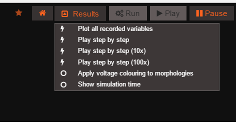

******************************\* MenuButton Component
Customization******************************\*

MenuButton is a button component that displays a list of executable
commands.



This button component can be reused, and added to the DOM at different
positions with different list options.

Custom Configuration ------------------The MenuButton can be configured
through a JSON object which is passed when the button is created. The
code below is an example of some of the things you can configure through
properties.

``` {.sourceCode .javascript}
var configuration = {
            id : "menuButton",
            openByDefault : false,
            closeOnClick : false,
            label: ' Results', 
            iconOn : 'fa fa-caret-square-o-up' , 
            iconOff : 'fa fa-caret-square-o-down',
            menuPosition : null,
            menuSize : {height : "auto", width : 300},
            onClickHandler : clickHandler,
            menuItems : [
                               {
                                   label: "Plot all recorded variables",
                                   action: "window.plotAllRecordedVariables();",
                                   value : "plot_recorded_variables"
                               },
                               {
                                   label: "Play step by step",
                                   action: "Project.getActiveExperiment().play({step:1});",
                                   value : "play_speed_1"
                               }
                               ]
    };
```

-   'id': {String} ID used to find this new button
-   'openByDefault': {boolean} Drop down opens by default when button is added.
-   'closeOnClick':
    {boolean} Drop down closes when an element is clicked
-   'label': {String} Label that is displayed in button
-   'iconOn':
    {String} Class of Font Awesome icon to used and be displayed in button when drop down is open
-   'iconOff':
    {String} Class of Font Awesome icon to used and be displayed in button when drop down is closed
-   'menuPositon':
    {JSON} Object with properties 'top','bottom','left','right' that gives the drop down menu its position e.g. {top:0,bottom:0,left:0,right:0}
-   'menuSize':
    {JSON} Object with properties 'width' and 'height' that gives the drop down menu its size e.g. {width:100,height :100}
-   'onClickHandler':
    {function} External Handler that is notified when element from drop down is clicked. See below for more info
-   'menuItems': {array} Drop down opens by default when button is added.

Using an External Click Handler ------------------The button can be
added an external click handler in the form of a javascript function,
which will be notified when an element in the button's drop down has
been clicked. The external handler function takes a parameter, which is
the value property of the element that was clicked.

The configuration in the code block above specifies an external handler
with the property "onClickHandler", the code below is an example of the
what the structure of the external handler passed should be.

``` {.sourceCode .javascript}
var clickHandler = function(value){
    //Do Something with value returned
};
```

Using MenuButton
================

To add a new button, call addComponent() function in
GEPPETTO.ComponentFactory class. The code below is an example of how to
add it, replace "MenuButton" with a different id for your own button
component.

``` {.sourceCode .javascript}
GEPPETTO.ComponentFactory.addComponent('MENUBUTTON', {configuration : configuration}, document.getElementById("MenuButton"));
```
