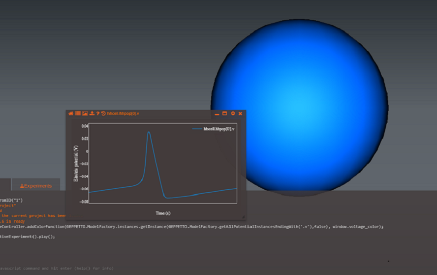

Plot Widget
===========

This widget allows Geppetto plotting of simulation variables and data

A new Plot widget can be created from the console using the command

``` {.sourceCode .javascript}
G.addWidget(Widgets.PLOT)
```

Alternatively *Shortcut Key: Ctl+Alt+P* - Toggles existing plotting
widgets, if none exist it creates a new one.

Plotting widgets can plot variables straight from the simulation, given
you are watching the variables at the time you start plotting it. Each
variable will have its own line plot, and it's accompanied by a label to
distinguish it from other variables being drawn.

In order to plot a Simulation variable, you can use the command

``` {.sourceCode .javascript}
Plot1.showLegend(true)
```

Where "Plot1" is the name of the plotting widget that was returned after
creation.



Other variables can also be plotted, as a two dimensional array plotted
against x and y coordinates. You can customize your line plot and change
the dimensions of the axis in your plot, use the "Commands" section as a
reference to see what options you have to modify your plot.


**Widget Options:**

On the top of the Plot Widget you'll find a toolbar, with it you can do:
-- Reset the widget to its original view with the first icon
-- Toggle the legend's visibility with the second icon
-- Download a screenshot of the widget with the third icon
-- Download the variable's data with the fourth icon


Showing/Hiding Legend----------To toggle the legend visibility
use the command below:

``` {.sourceCode .javascript}
Plot1.showLegend(true)
```

Download X/Y Axes Data----------Used the command below for downloading
a zip file containing the files with the Plot's variable data:

``` {.sourceCode .javascript}
Plot1.downloadPlotData()
```

Download Screenshot of Plot Widget---------Saving a screenshot of the 
Plot widget can be achieved with:

``` {.sourceCode .javascript}
Plot1.downloadImage(type)
```
Where type can be : "JPEG", "PNG" or "SVG"

Setting Options ----------User can modify a Plot Widget settings,
including: x and y axis, line plot's visibility of points and lines.
Create a javascript object in the console specifying the options, and
use setOptions() with the created object to set the options for the Plot
Widget.

The following values can be used to modify a Plot settings.

-   yaxis - Object that sets a minimimum and maximum value for the Y
    axis of the graph. Use {yaxis : { min : 'value', max : 'value'}} to
    set yaxis.
-   xaxis - Object that sets a minimimum and maximum value for the X
    axis of the graph. Use {xaxis : { min : 'value', max : 'value'}} to
    set xaxis.
-   showlegend - Boolean used to toggle visibility of the Plot's legend
-	mode : Type of graph, "lines" for line graphs or "markers" for graphs
    made with points.

**Example:**

``` {.sourceCode .javascript}
var linePlotOptions ={
		showlegend : true,
        yaxis: { min : 0,max : 15},
        xaxis: {min : 0, max : 15},
        modes : "lines"
}

//set the options for the plot
plot1.setPlotOptions(plotOptions);
```
