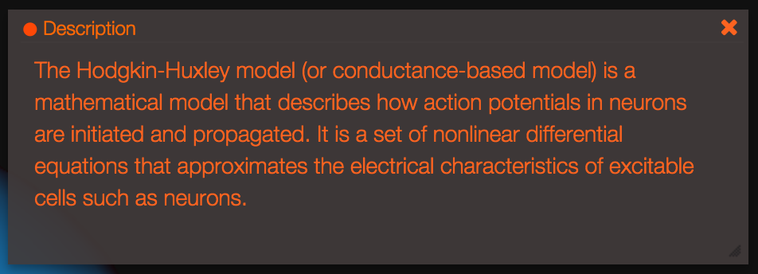
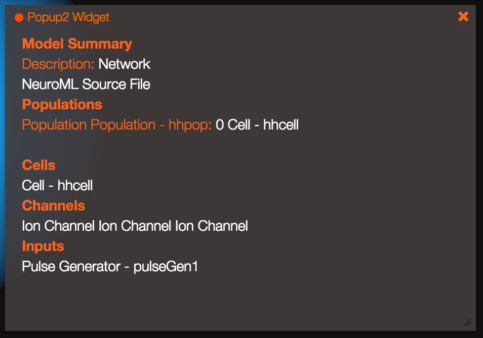

***************
Popup Widget
***************

The popup widget allows the user to create a simple widget to display informative text / HTML.

The following code creates a widget to add a simple text description to the model:

.. code-block:: javascript

	G.addWidget(Widgets.POPUP);
	Popup1.setName("Description");
	Popup1.setMessage("Model description");

An example of how this might look like with simple text and HTML is shown below:

	
Other than for displaying simple text / HTML, the popup widget can be used to let the user interact with the simulation associating scripts to user actions via HTML anchor elements. Anchor elements can point to Geppetto entity nodes via the 'instancepath' attribute, and custom handlers can be associated to user actions (browser events such as 'click', 'dblclick', etc.) via the addCustomNodeHandler method. The entity node will be received as a parameter of the custom handler.

An example is shown below:

.. code-block:: javascript

	G.addWidget(Widgets.POPUP);
	Popup2.addCustomNodeHandler(function(node){alert(node.getName());}, 'click');
	Popup2.setMessage("Some HTML here linking to a specific entity <a href="#" instancepath="mySuperEntity.myAspect.MyEntity">entity</a>");
	
In the example above, when the user clicks on the entity link the custom handler will be invoked. The custom handler takes the entity node as a parameter, coming from the instancepath attribute of the anchor element. If the value in the instancepath attribute does not map to an actual entity in the active Geppetto experiment, the custom handler 'path' parameter will be undefined.

