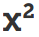
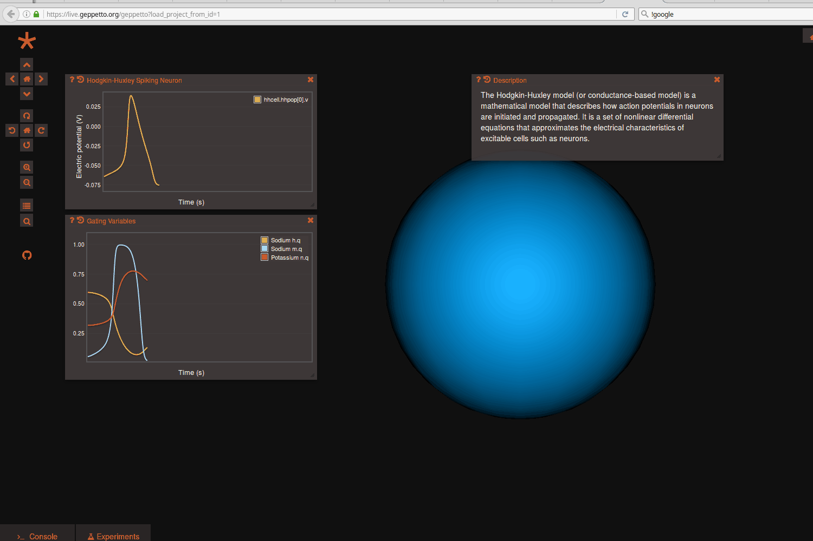

*******************
Recording Variables
*******************

Note: Recording variables and running simulations are only possible in Geppetto deployments that support these functionalities.

Any state variable that exists in the model can be recorded prior to running
a simulation, meaning it will be possible to subsequently plot its values
once the simulation is complete. You can record a variable by searching for it
in the search bar (open it using the little search icon on the left hand side of
the screen

 
or pressing Ctrl+Space) and clicking on the Record icon 

   
The icon signifying state variables that can be recorded is the superscript icon 

   

 
