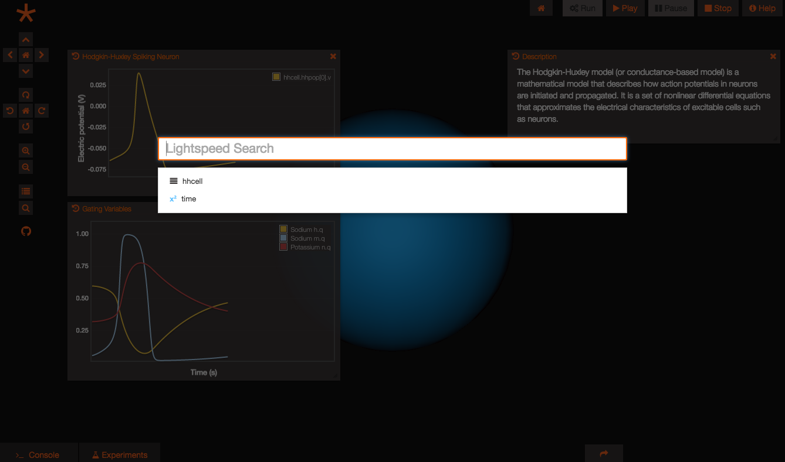

Lightspeed Search Customization
===============================

The lightspeed search (CTRL+SPACE or the magnifying glass button on the
left bar to open) lets users search for instances and potential
instances in a given Geppetto project.



This search functionality can be interacted with via its API. The main
interaction currently available and exposed to developers is the open
command, that combined with various parameters opens the spotlight with
various options.

Open in Search Flow -----------

``` {.sourceCode .javascript}
GEPPETTO.Spotlight.open(GEPPETTO.Resources.SEARCH_FLOW);
```

This is the default flow that is triggered when the user opens the
lightspeed search with the "SEARCH\_FLOW" parameter or with no
parameters. The search runs on all potential instances in the scene.

Open in Run Flow --------

``` {.sourceCode .javascript}
GEPPETTO.Spotlight.open(GEPPETTO.Resources.RUN_FLOW);
```

This flow is triggered when the user hits the run button (or equivalent
API command). A default suggestion is added to the spotlight to provide
the user with the ability to record all state variables in the current
model.

Open in Play Flow ---------

``` {.sourceCode .javascript}
GEPPETTO.Spotlight.open(GEPPETTO.Resources.PLAY_FLOW);
```

This flow is triggered when the user hits the play button (or equivalent
API command). A default suggestion is added to the spotlight to provide
the user with the ability to plot all recorded state variables available
in the instance tree.

Custom Suggestions
------------------

Suggestions can be added to the lightspeed search via the .addSuggestion
API method, and they can be associated with flows that will trigger
them.

Custom actions and icons can be associated to suggestions as shown in
the example below (these suggestions will show up in the list of
suggestions when the user triggers the play flow by clicking the play
button or using equivalent API commands):

``` {.sourceCode .javascript}
var plotSample = {
    "label": "Plot all recorded variables",
    "actions": [
        "var p=G.addWidget(0).setName('Recorded Variables');",
        "$.each(Project.getActiveExperiment().getWatchedVariables(true,false),function(index,value){p.plotData(value)});"
    ],
    "icon": "fa-area-chart"
};

this.addSuggestion(plotSample, GEPPETTO.Resources.PLAY_FLOW);
```

What Next?
----------

Currently ongoing:

-   Add the .addDataSource API method to allow additional datasources to
    be added via script

Backlog:

-   Make capabilities based configuration configurable via script
-   Share capabilities based configuration with the control panel

