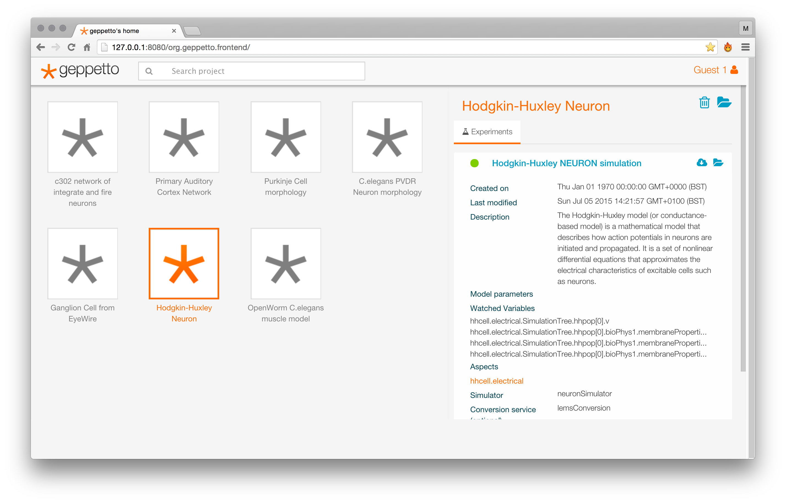
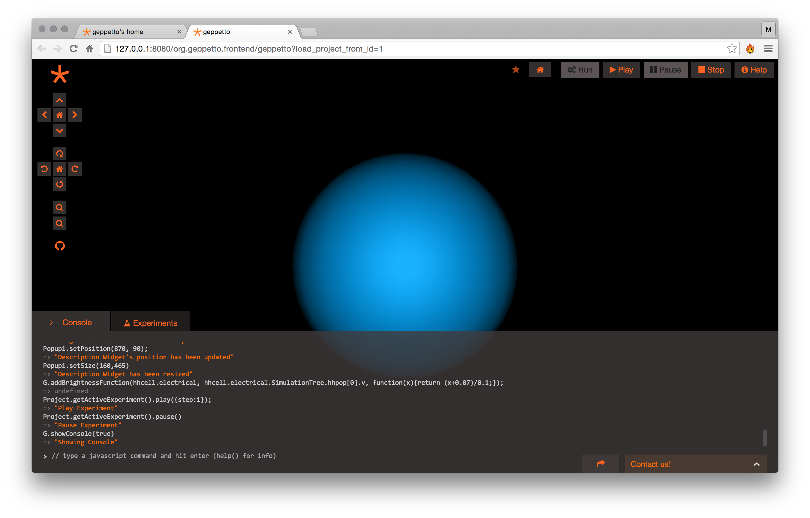
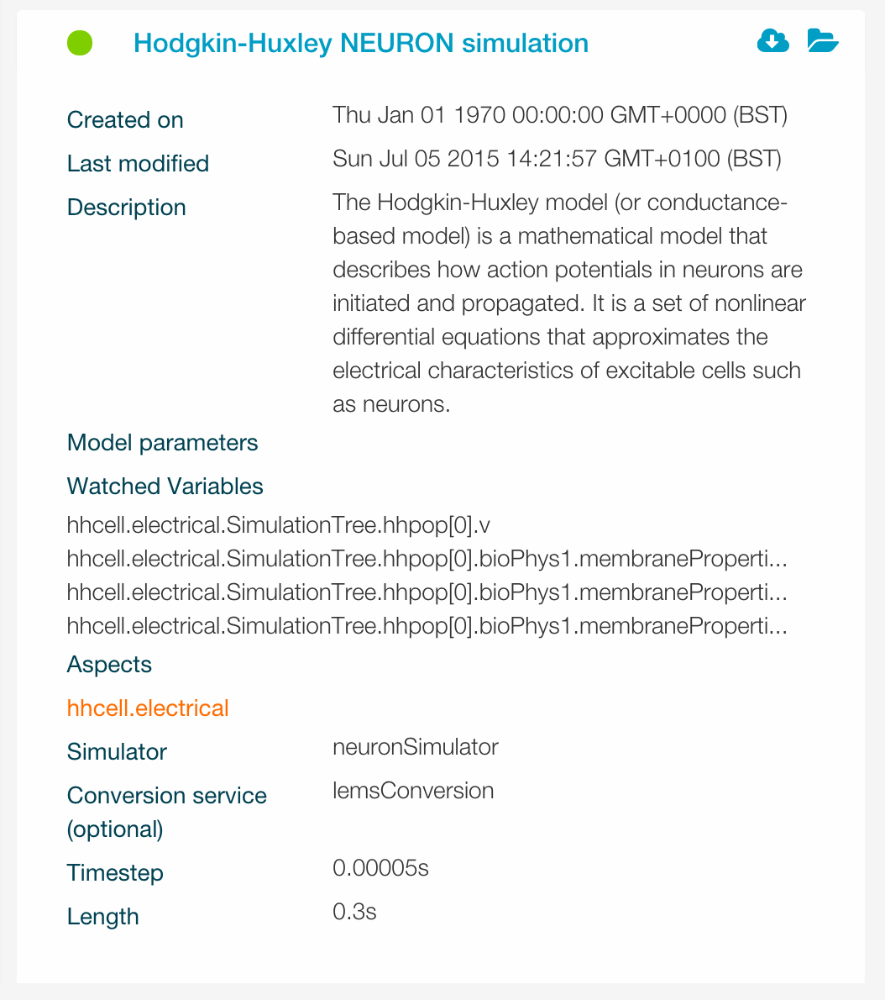
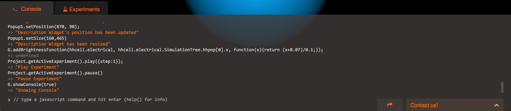

.. _userdocs:

***************
Geppetto basics
***************

This section is your key to getting started with Geppetto. It will explain the Geppetto interface, loading projects, opening widgets, and running simulations.
When you are finished reading this section, you will understand how Geppetto works and how to use it to explore a computational model.

* Learning the interface
* Dashboard
* Project workspace

Learning the interface
======================

Geppetto has two main interfaces: the **Dashboard** and the **Project workspace**.
The purpose of the dashboard is to easily view at a glance all the projects that are available to the user.

**Dashboard** - In the demo deployment of Geppetto the dashboard shows some sample projects for a guest user.

Selecting a project in the left pane of the dashboard will reveal project details in the right pane. Double clicking on a project in the left pane will open the selected project in a new browser tab.

**Project workspace** - The project workspace shows the morphologies, meta-data and simulation data associated with a given project.

Dashboard
=========

The dashboard is the main entry point to a geppetto based application. The dashboard shows you which projects are available to you. The top right corner indicates which user is logged in for the current session. In the demo deployment of Geppetto this will read "Guest" because there is no peristence database behind it. Geppetto can be configured to work with user accounts.

Projects
--------

Project
	A Geppetto project is the container of a geppetto model. For more details about how a geppetto model is defined click here.
	A project allows you to perform multiple computational experiments on the model associated to the project.

The bar at the top allows you to filter the list of projects, just type in it to search for a specific one.
The right pane shows which experiments are available in the selected project.

Experiments
-----------

Experiment
	A computational experiment in Geppetto lets you specify what value you want to assign to the parameters available in your model and which variables you wish to record when you run a simulation of your model.

	Recorded variables are called **watched variables** while the parameters are called **model parameters**. An experiment also allows you to specify the **simulation parameters** such as timestep, simulation length and which simulator to use in the given experiment. Watched variables and model/simulation parameters can be edited from the Project workspace (explained later in this tutorial).

An experiment can be in multiple states indicated by a different colour:

Design (Orange)
	The experiment is in design state and editable, it is possible to selected which variables are going to be watched when the experiment will run and set model/simulation parameters associated with it.
Queued (Blue)
	The experiment simulation has been queued and will be executed by the geppetto scheduler as soon as possible (depending on how many experiments are in the queue), from now on the experiment is "read only", you can no longer add variables to the watch list or edit parameter values.
Running (Yellow)
	The experiment simulation is currently being executed.
Complete (Green)
	The experiment simulation is completed. It is now possible to replay it and visualize the simulation results. Experiment replay and model visualization are accessible from the Project Workspace view (covered later in this document).
Error (Red)
	An error occurred while executing the experiment simulation.

Project workspace
=================

Double clicking a project from the dashboard will open the project in the project workspace. The project workspace allows the user to visualize the models associated with the project, to create experiments and to simulate them with different available simulators.

The default experiment will be loaded when the project is opened, and it will be highlighted in the "experiments" tab of the console at the bottom of the screen. If there is more than one expriment for the current project multiple rows will appear in the experiments tab. Clicking on the row will reveal experiment details and will let the user edit parameters.

Console interaction
-------------------

The console can be opened by clicking on the at the bottom of the screen and is collapsed by default (once opened, clicling the bar header will function as an expand/collapse toggle). The environment is completely javascript scriptable and any action performed via UI interaction can be reproduced via the javascript console commands. Whenever the user interacts with the UI in the project workspace, the corresponding API commands will be printed in the console at the bottom of the screen (collapsed by default). Playing witht he UI and the looking at the console is an easy practical way to learn more about the Geppetto Javascript API. The console history can be easily exported to text file.

Model visualization
-------------------

When an experiment is loaded (upon opening a project the default experiment is loaded), if a 3D representation of the model morphology is available it will be immediately visualized in the 3D canvas, the main area of the screen. The user can interact with the 3D canvas and the scene in it representing the model with intuitive mouse movements, dragging around with left button for rotation, right button for paninng and mouse wheel for zooming. The camera controls are also available on the top-left bar, including buttons for rotation, panning and zooming. Upon loading Geppetto will make an attempt at centering hte model based on its initial geometries. The control bar also has a "home" button that will bring the model back to the initial centered position.

New experiment
--------------

New experiments can only be created if the persistence bundle of Geppetto is installed ina given deployment (note: this is not the case on the live.geppetto.org demo).

A new experiment can be created clicking on the "+" button visible at the top right of the experiments tab, and a row will be added to the experiments table. Editable fields can be edited by clicking on them.

Once the experiment is created the user can:

* Edit the experiment name by clicking on it
* Expand experiment details by clicking on the experiment row
* Edit simulation parameter from the experiment details (by clicking on the fields, same as the name), once the row is expanded. (i.e. Simulator --> neuronSimulator Time step --> 0.00005s Length --> 0.3s)
* Add simulation variables to the watch list (*)

(*) At the moment the only way to add variables to the watch list is via the console, using the Geppetto javascript API.

Simulate experiment
-------------------

Replay experiment
-----------------
