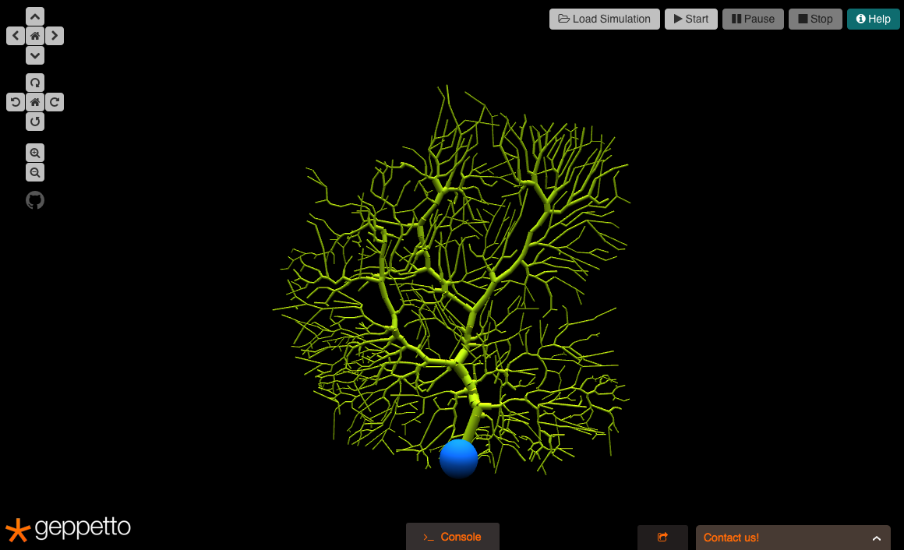
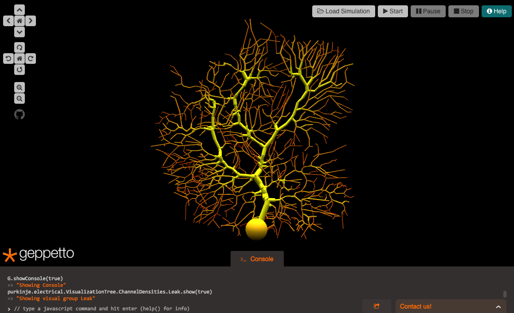

Visual Groups
=============

Visual Groups allow the users to visualize an entity colouring its
different elements according to a set of properties related to the
entity itself. A visual group can for instance allow the user to see the
different cell regions of a neuron or the distribution of one type of
ion channel.





Getting Started
---------------

Visual Groups are defined inside the Visualization Tree of an aspect. To
find and show visual groups in the Geppetto UI, the Geppetto console or
the Tree Visualizer Widget must be used. To show all visual group
elements for an entity from the console, navigate up to the
VisualizationTree for a given aspect of a given entity and run the
getChildren() command on it. Alternatively, entering a "double tab"
after typing up to VisualizationTree will show all elements contained
inside the tree:

``` {.sourceCode .javascript}
Entity.Aspect.VisualizationTree
```

Once the groups are revealed, the user can navigate to any of them and
use the "show(visible)" command to visualize all visual objects that
belong to this group, where "visible" must be true or false:

``` {.sourceCode .javascript}
Entity.Aspect.VisualizationTree.Group1.show(true);
```

The above command shows all the visual objects that belong to the group
in object by coloring. The color is specified in the Visual Group
Element node or by parameter.

The command below hides all visual objects that belong to Group 1 if
they are being displayed:

``` {.sourceCode .javascript}
Entity.Aspect.VisualizationTree.Group1.show(false);
```

Visual group elements can also be visualized individually with the
"show(visible)" command.

``` {.sourceCode .javascript}
Entity.Aspect.VisualizationTree.Group1.Element1.show(true);
```

Console Commands ---------The entire set of commands for visual groups
are:

``` {.sourceCode .javascript}
-- VisualGroup.getType()
   Gets type of visual grup

-- VisualGroup.show(mode)
   Shows the visual group

-- VisualGroup.getChildren()
   Gets all children of this visual group

-- VisualGroup.getVisualGroupElements()

-- VisualGroup.getLowSpectrumColor()

-- VisualGroup.getHighSpectrumColor()
```
