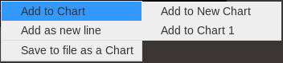

Geppetto Widgets Tutorial
=========================

> -   Creating a Widget
> -   Adding Widget to Geppetto
> -   Using a Widget Inside Geppetto
> -   Contributing to other widgets
> -   Allow other widgets to contribute to my widget

Creating a Widget
-----------------

> A template for new widgets is available inside
> /org.geppetto.frontend/src/main/webapp/js/widgets/template copy and
> paste that folder and name it after the widget you wish to add. In the
> template the widget is called WIDGETNAME. Search for WIDGETNAME inside
> /org.geppetto.frontend/src/main/webapp/js/widgets/ to easily find the
> places that need to be changed to add a new widget.

This tutorial will describe the steps needed start creating your own
Geppetto Widget. To begin, you will want to set up a specific file and
folder structure. Let’s say you are interested in creating a Geppetto
Widget that can plot one or multiple Simulation Variables values in a
chart. For example, let’s call it a “Chart” Widget. The first step would
be to create the folder structure, which consists of a parent folder
named after the Widget and multiple folders inside it for the
controllers and vendor libraries. Your folder structure should look
something like this: :

    /chart
       /controllers
       /vendor

The widget will use a combination of Javascript and CSS files,
consisting of a main class, configuration script, controller class and a
styling CSS file. Below is a brief explanation of the purpose of each of
these files.

### Files Needed

Recommended files needed for creating a widget:

  ------------------------------------------------------------------------
  File Format    Example    File Function
  -------------- ---------- ----------------------------------------------
  \[NameofWidget Chart.js   Main class of widget: instructions for how the
  \].js                     code should behave goes in here.

  config.js      config.js  Configuration class for the widget: use to
                            specify the libraries for the widget and
                            export the scripts using requireJS

  \[NameofWidget Chart.css  Use to customize your widget.
  \].css                    

  \[NameofWidget ChartContr Use to bind Geppetto with your widgets: tells
  \]Controller.j oller.js   your widget what to do when Geppetto tells it
  s                         to do it.
  ------------------------------------------------------------------------

External libraries and existing plugins can be used as part of your
widget. Your newly-created widget class should be the one communicating
and using the external librarie's plugins. For example, if wanted to
create a widget to chart things in Geppetto, and you know of a
javascript library that does charting, you can use that library as a
dependency for your widget and build on top of it rather than having to
write charting from scratch.

### Creating the Main Widget Class

A superclass called
[Widget.js](https://github.com/openworm/org.geppetto.frontend/blob/development/src/main/webapp/js/widgets/Widget.js#L43)
exists and this contains getters, setters and other global methods for
properties that all widgets have, including name, position, id, size,
and visibility. The widget class you will be creating extends this
superclass.

``` {.sourceCode .javascript}
var Chart = Widget.View.extend({
})
```

Next you will need to populate the class with methods corresponding to
the functionality of the widget, such as plotting and updating the chart
data. It is within the main widget class that you can use external
libraries and plugins to build the widget. Look at the
[Plot.js](https://github.com/openworm/org.geppetto.frontend/blob/development/src/main/webapp/js/widgets/plot/Plot.js#L38)
widget as an example of a widget built on top of an external library.

### Creating the Controller Class

The Controller class regulates the handling of events received from
Geppetto and how they interact with your widget. The WidgetsListener
class, located in the “Widgets” folder, will already handle many of the
event types shared among all widgets (e.g., those implemented in
Widget.js superclass) including notifying all widgets about new updates.
However, you should add an update method to your controller class to
handle how updates are sent to the widgets. Other methods that can be
added to the controller class are “addWidget()” and “removeWidget()”,
which control the creation of your widgets. Take a look at the
PlotsController for an example of how to do this.

``` {.sourceCode .javascript}
define(function(require) {
return function(GEPPETTO) {
    //Rest of Controller code
    }
}
```

### Creating the config.js Class

The purpose of having a config.js class inside your widget folder is to
specify the libraries for the widget and be able to export them via this
script. To export the libraries, use [requireJS
library](http://requirejs.org/), which allows scripts to load
dynamically. If you want to add the files for the widget you just
created, include the following lines in the config.js file.

``` {.sourceCode .javascript}
var chartModule = [];
chartModule("widgets/chart/vendor/chartsplugin-1.0");
chartModule("widgets/chart/Chart");
```

Where the array chartModule holds the path of all the JS libraries
needed for the widget, the “.js” extension can be omitted when adding
the scripts to the array, however, the omission is not required. Notice
that the controller class has been omitted for now, we will be adding
that class as an AMD Module which is explained in the next section.

When you have finished populating your chartModule array with your
scripts, add them to Geppetto using requireJS as in the example below.
The function(\$) will be called once the scripts have been loaded
successfully, at which time you will be able to load the CSS files for
the widget.

``` {.sourceCode .javascript}
require(chartModule, function($) {
   loadCss("js/widgets/chart/Chart.css");
});
```

### Folder Structure

As an example, you have finished creating that widget named “Chart” for
which you used an external library named “chartsplugin-1.0”. The folder
structure of the widget should look like this: :

    /chart
       -Chart.js
       -Chart.css
       -config.js
       /controllers
         -ChartController.js
       /vendor
         -chartsplugin-1.0.j

The folder named “chart” holds the main widget file “Chart.js” and the
related CSS file. The “controllers” folder contains the class binding
Geppetto with the widgets. Tthe “vendor” folder contains the external
libraries used to create this widget.

Adding Widget to Geppetto
-------------------------

If you have structured your folder using the recommended structure from
the [previous
section](https://docs.google.com/a/metacell.us/document/d/160pXT0CProgY2xs5Y8zdHnVGZuV_X-A6ZWvYWnAIYDQ/edit#heading=h.5ncyvsoawo2),
you can then drop them inside the “widgets” folder located in the
frontend bundle under “src/main/webapp/js”.

Locate the file “src/main/webapp/js/main.js” and import your widget by
adding the location of the script using requireJS. Using our widget
example above, we would add the following line to the config.js file.

``` {.sourceCode .javascript}
require(“widgets/chart/config.js”, function($) {});
```

Using a Widget Inside Geppetto
------------------------------

If you would like to use your widget from the console within Geppetto,
there are a few additional steps. First, you will need to expand the
“WidgetFactory.js” class inside the frontend bundle to handle adding and
removing your new widget via the console.

To do this, first add the type of your new widget to the global
“Widgets” variable. Simply add the name of your widget followed by the
next number from the sequence of previously added widget types. The
example “CHART,” would look like this:

``` {.sourceCode .javascript}
var Widgets = {
      PLOT : 0,
      CHART : 1
    };
```

Inside the WidgetFactory.addWidget(widgetType) method, add a case inside
the switch statement that connects it to your controller’s new widget
method. For example:

``` {.sourceCode .javascript}
case Widgets.CHART:
     widget = ChartController.addChartWidget();
     break;
```

Follow the same logic for WidgetFactory.removeWidget(widgetType):

``` {.sourceCode .javascript}
case Widgets.CHART:
     widget = ChartController.removeChartWidget();
     break;
```

Doing this will allow you to create new widgets from the console using
the following commands:

``` {.sourceCode .javascript}
G.addWidget(Widgets.CHART);
G.removeWidget(Widgets.CHART);
```

Selection Event
---------------

Selecting and entity or aspect inside Geppetto generates an events, that
all subscribing listeners can detect. In order to detect selection
changes, the update method in your controller must look for the
SELECTION\_CHANGED event. Then you can call;

``` {.sourceCode .javascript}
Simulation.getSelection()
```

which will return an array of the entities that are currently selected.

Contributing to other widgets
-----------------------------

Geppetto provides a framework for contributing to other widgets through
specific actions. The widget may register a/some commands provider to a
data type. Any time the user right-click on an object of this data type,
a context menu will display the actions generated by the command
provider. These actions can be generated dynamically depending by the
commands provider depending on the data selected by the user.

To contribute with actions to any widget, firstly we have to register in
“Geppetto.MenuManager“ the data type and the related commands provider.
This needs to be done in the config.js file of the widget. Keep in mind
the commands providers should be in the Widget Controller. The
registration process in the example "CHART" would look like this:

``` {.sourceCode .javascript}
GEPPETTO.MenuManager.registerNewCommandProvider([dataType], GEPPETTO.ChartController.getCommands);
```

Inside the ChartController.getCommands(node) method add the code you
would like to in order to return a set of menu items. The events
framework will provide as a parameter the data structure of the element
right-clicked. These actions can be static menu items or generated
depending on the data.

The object to be returned is an array, each object in the array is
considered a menu group. Inside each menu we can add as many menu items
as you would like to. Each menu item should have a label and may have an
icon, an action (again bear in mind this action should be located in the
widget controller), a position (this parameters will be used to set the
position of the menu item inside the menu group) and another set of
groups. Obviously, this set of groups should have the same structure as
any menu group and will be displayed as nested group inside the parent
element. The returned object structure should look like this:

``` {.sourceCode .javascript}
var returnedMenuItems = [
              [
               {
                label: "Add to Chart",
                icon: "icon0",
                position: 0,
                groups: [
                          [
                           {
                            label: "Add to New Chart",
                            action: GEPPETTO.ChartController.addChart,
                            icon: "icon01",
                            position: 0
                           },
                           {
                            label: "Add to Chart 1",
                            action: GEPPETTO.ChartController.addChart,
                            icon: "icon02",
                            position: 1
                           }
                          ]
                        ]
               },
               {
                label: "Add as new line",
                action: GEPPETTO.ChartController.addNewLine,
                icon: "icon1",
                position: 1
               }
              ],

              [
               {
                label: "Save to file as a Chart",
                action: GEPPETTO.ChartController.saveChart,
                icon: "icon2"
               }
              ]
            ];
```

The menu layout would look like:



If the user clicks on any menu item the framework will call back the
corresponding action providing as a parameter the data related to the
element right-clicked. The developer has to implement the logic inside
this method.

Allow other widgets to contribute to my widget
----------------------------------------------

If you would like other widgets to contribute to the context menu of
your widget you need to add some lines of code. First, you have to add a
dictionary ("events") to your widget. The dictionary key will be the
event name ("contextmenu") followed by the jquery selector. As the value
you will set the function in charge of managing the event. See example
code below:

``` {.sourceCode .javascript}
events : {
  'contextmenu .title' : 'manageRightClickEvent'
}
```

Note you can also use this "events" object to define any other kind of
events, as for instance "click" or "submit", within your widget.
Geppetto event framework is based on "Backbone". You can find some good
examples about how to use "Backbone" events
[here](http://www.codebeerstartups.com/2012/12/12-listening-to-dom-events-in-backbone-js-learning-backbone-js)
or just googling.

'manageRightClickEvent' will be called when we right-clicked on any
element which has a "title" class. In this method you will have to add
the code in order to get the node data and pass it together with the
event to the 'showContextMenu' method of the "Widget" superclass.

``` {.sourceCode .javascript}
manageRightClickEvent : function(event) {
  [Code for getting the node data. Node that in $(event.target) give you the element which has been right-clicked.]
  this.showContextMenu(event, node);
}
```
